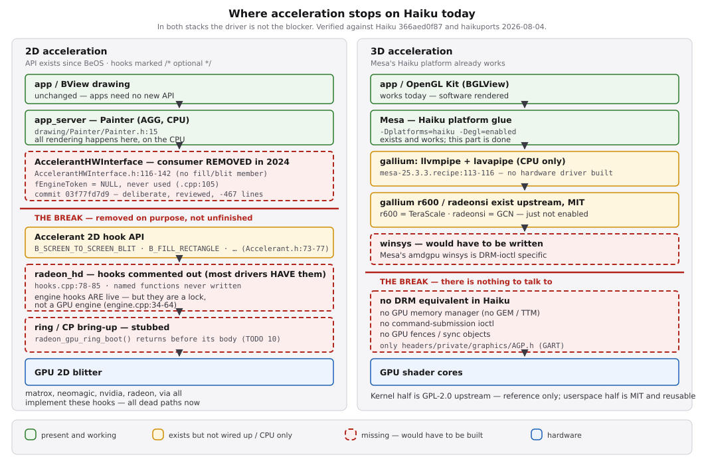

# 2D and 3D acceleration on Haiku — feasibility review

**Status:** research only. No code, no commitment. Written so the findings below
do not have to be rediscovered.
**Scope note:** both efforts described here fall **outside** this fork's
driver-only, display-only remit. This document exists to make that conclusion
checkable, not to plan the work.

All file:line references are against the Haiku tree at `origin/master`
`366aed0f87` and `haikuports` as of 2026-08-04.



---

## 1. Verdict up front

| | 2D acceleration | 3D acceleration |
| --- | --- | --- |
| API exists? | **Yes**, since BeOS | Partly — Mesa's Haiku platform works |
| Hardware driver support? | Widely implemented — but not in `radeon_hd` | No |
| **Real blocker** | **`app_server` deliberately removed the consumer (2024)** | **Haiku has no DRM equivalent** |
| Blocker lives in | `src/servers/app/` — outside this tree | kernel + Mesa — outside this tree |
| Donor code | Good: in-tree, license-clean | Userspace half free, kernel half GPL |
| Realistic payoff | Modest (window moves, fills) | Large, but so is the cost |
| Verdict | Settled upstream — do not pursue | Not a driver project |

The surprise in both cases is that **the driver is not the hard part**.

## 2. 2D acceleration

### 2.1 The API has been there all along

`headers/os/add-ons/graphics/Accelerant.h:73-77` defines four 2D hooks, all
marked `/* optional */`:

- `B_SCREEN_TO_SCREEN_BLIT`
- `B_FILL_RECTANGLE`
- `B_INVERT_RECTANGLE`
- `B_FILL_SPAN`

plus `B_SCREEN_TO_SCREEN_TRANSPARENT_BLIT` and
`B_SCREEN_TO_SCREEN_SCALED_FILTERED_BLIT`.

### 2.2 Most accelerants implement them — and it does not matter

Contrary to first impressions, 2D acceleration is **widely implemented** across
Haiku's accelerants. Surveying every driver in `src/add-ons/accelerants/` with
comments stripped (so `HOOK()` macros and commented-out blocks are classified
correctly):

| Accelerant | 2D hooks dispatched | Implementations present |
| --- | --- | --- |
| `matrox`, `neomagic`, `nvidia`, `radeon`, `via` | 4 | yes |
| `skeleton` (driver template) | 4 | yes |
| `et6x00` | 2 | yes |
| `3dfx`, `ati`, `intel_extreme`, `s3` | 4 | dispatched |
| **`radeon_hd`** | **0 — commented out** | no |
| `framebuffer`, `intel_810`, `vesa`, `virtio`, `common` | — | — |

So `radeon_hd` is the outlier, not the rule. The old `radeon` accelerant
(R100–R500) has had working 2D acceleration for over twenty years.

### 2.3 The blocker: `app_server` deliberately removed the consumer in 2024

This is the fact that decides the question. Support was not left unfinished — it
was **deleted on purpose**:

```
commit 03f77fd7d9db4d323942d5f86b8d54b8a8c8d56a
Author: X512 <danger_mail@list.ru>
Date:   Fri Nov 29 06:57:33 2024 +0900

    app_server: drop legacy 2D hardware acceleration
```

Reviewed by Axel Dörfler and waddlesplash; −467 lines across `Window.cpp`,
`DrawingEngine.{cpp,h}`, `HWInterface.h` and `AccelerantHWInterface.{cpp,h}`.
The stated reasons, verbatim from the commit:

- *"It is not enabled for a long time and is actually a dead code."*
- *"It was tested before that it is actually slower on < 15 year old hardware so
  it have no any benefits. Modern CPUs have no problems with simple memory
  filling/copying operations. More complex acceleration operations are not
  supported in current accelerant driver API."*
- *"It breaks double buffering and reintroduce flickering artefacts."*
- *"It is incompatible with antialiased CPU drawing because GPU framebuffer
  memory reading is deadly slow and reading is required for alpha blending
  operation. So rendering buffer must be in CPU memory, offscreen GPU buffer
  can't be used."*
- *"Hardware 2D acceleration for modern hardware is usually implemented using
  generic GPU rendering APIs such as OpenGL or Vulkan."*

The fourth point is the deep one, and it is architectural rather than a matter of
hardware speed. Haiku draws antialiased, alpha-blended output, which requires
**reading the destination**. Reads back from VRAM across PCIe are punishingly
slow, so the render target must live in CPU memory — and a GPU blitter cannot
participate in a pipeline whose target it cannot cheaply read. No amount of
driver work changes that.

### 2.4 State of `app_server` today

`AccelerantHWInterface` acquires only modesetting, cursor, DPMS, EDID and retrace
hooks; its member list
(`src/servers/app/drawing/interface/local/AccelerantHWInterface.h:116-142`)
has no fill, blit or invert entry, and `fEngineToken` is initialised to `NULL`
(`AccelerantHWInterface.cpp:105`) and never used again.

The only remaining consumer of the 2D hooks in the tree is
`src/servers/app/drawing/interface/virtual/DWindowHWInterface.cpp:555-593` — the
nested harness that runs `app_server` in a window on another Haiku, which was
left alone by the removal.

Drawing is CPU-side: `Painter` is built on AGG (`Painter.h:15`), and the only
blit-shaped operation on `HWInterface` is `CopyBackToFront()`
(`HWInterface.h:148`), which `AccelerantHWInterface` does not override.

Vestiges survived the removal: `fRectParams` / `fBlitParams` are still allocated
in the constructor (`AccelerantHWInterface.cpp:154-157`), freed in the destructor
(`:172-173`), null-checked during init (`:188`), and `_RegionToRectParams()`
(`:1394`) still populates them — but **nothing calls that helper**. A small
upstream cleanup, not our tree.

**Consequence:** implementing these hooks in `radeon_hd` produces code nothing
calls, and re-adding the consumer would mean reverting a reviewed architectural
decision. This is the `radeon_gpu_reset()` mistake (see
[`gpu-soft-reset-review.md`](gpu-soft-reset-review.md)) one layer higher — except
here the dead end is upstream and intentional.

### 2.5 What our driver has today

Someone already started and stopped at exactly this boundary:

| Piece | State |
| --- | --- |
| `B_ACCELERANT_ENGINE_COUNT` | live — returns `1` |
| `B_ACQUIRE_ENGINE` / `B_RELEASE_ENGINE` | live, but they are a **lock**, not a GPU engine: acquire takes `shared_info->engine_lock` and hands back a static `engine_token` |
| `B_SCREEN_TO_SCREEN_BLIT`, `B_FILL_RECTANGLE`, `B_INVERT_RECTANGLE`, `B_FILL_SPAN` | **commented out** in `hooks.cpp:78-85` |
| `radeon_screen_to_screen_blit()` etc. | **never written** — the commented lines are the only references in the tree |
| `RingQueue` | class exists |
| `radeon_gpu_ring_boot()` | stub: logs `"%s: TODO"` and returns before its body (TODO item 10) |

### 2.6 What the work would take, if the decision were ever reversed

Recorded for completeness only — step 1 below means reverting `03f77fd7d9`, so
this is not a plan. Two halves that must land together or neither functions:

**`app_server` side** (outside this tree, and against a reviewed decision)
1. Have `AccelerantHWInterface` acquire the engine and the 2D hooks when present.
2. Route `_CopyBackToFront()` and region fill/invert through them, with the
   existing AGG path as fallback.
3. Handle sync: `sync_token` round-trips so software drawing cannot race the
   engine mid-blit.

**Driver side** (in this tree, but useless without the above)
1. Real ring bring-up: CP init, GART-backed ring buffer, doorbell/write-pointer
   handling — i.e. finish what `radeon_gpu_ring_boot()` stubs out.
2. PM4 packet emission for the blit/fill primitives.
3. Fencing so `sync_token` means something.
4. Per-generation packet differences across TeraScale → GCN.

### 2.7 Payoff

Modest, and worth being honest about: window moves, scrolling, solid fills.
Application rendering stays on the CPU because that is where `Painter` lives.
This will not make WebPositive faster.

## 3. 3D acceleration

### 3.1 Mesa on Haiku is CPU-only today

From `haikuports/sys-libs/mesa/mesa-25.3.3.recipe:113-116`:

```
-Degl=enabled -Dglvnd=enabled -Dglx=disabled -Dplatforms=haiku
-Dgallium-drivers=llvmpipe
-Dvulkan-drivers=swrast
```

llvmpipe and lavapipe — software rasterisers. The encouraging part is that
Mesa's **Haiku platform glue already exists and works**; the gap is entirely
below it.

### 3.2 The blocker: no DRM equivalent

Haiku has no kernel graphics-memory or command-submission subsystem. Searching
the tree finds no GEM, no TTM, no `/dev/dri`, no submission ioctl, no GPU fence
or sync primitive. What exists is `headers/private/graphics/AGP.h` (GART) and
per-driver register headers.

On Linux, `radeonsi` reaches hardware through libdrm's amdgpu ioctls. On Haiku
there is nothing for a winsys to talk to.

### 3.3 Prerequisites, in dependency order

1. Kernel GPU memory manager — VRAM/GTT allocation, mapping, eviction.
2. Command submission — a validated submit path from userland.
3. Fences and sync objects.
4. A Mesa winsys targeting that interface (replacing `winsys/amdgpu/drm`).
5. Only then: enable a hardware gallium driver.

Items 1–3 are an **operating-system subsystem**, and the ABI belongs to Haiku's
maintainers, not to a driver fork. Nothing here can be done unilaterally.

## 4. Donor code

| Source | Licence | Usefulness |
| --- | --- | --- |
| **Haiku `src/add-ons/accelerants/radeon/`** (R100–R500) | in-tree, Haiku's MIT tree licence; `Acceleration.c` carries only a `Copyright (c) 2002, Thomas Kurschel` line | **Best 2D donor.** `Acceleration.c` implements blit/fill/invert/span in **both DMA and PIO** forms; `CP.c` does command-processor bring-up; `EngineManagment.c` does engine tokens and sync. Same vendor, license-compatible by construction. Packet format differs for R600+ (PM4), but the structure transfers. |
| **Mesa gallium `r600`** | MIT | Covers **TeraScale (Evergreen / Northern Islands)** — this driver's core hardware. Upstream and maintained. |
| **Mesa gallium `radeonsi`** | MIT | Covers GCN, including our Bonaire test card. |
| Mesa `winsys/{radeon,amdgpu}/drm` | MIT | The part that would have to be **replaced**; useful as a specification of what a winsys requires. |
| libdrm | MIT | Only relevant if Haiku reimplements the same ioctls. |
| Linux `radeon` / `amdgpu` | **GPL-2.0** | Reference for logic only, per project policy — cannot be merged into the MIT Haiku tree. Note a GPL-2.0 *standalone* Haiku driver is an established pattern (our AST2400 driver), so a GPL kernel module outside the MIT tree is not unprecedented. |

### 4.1 The licensing asymmetry

The **userspace** half — Mesa, the genuinely hard graphics engineering — is MIT
and reusable as-is. The **kernel** half, which is comparatively well-understood
work, is GPL-2.0 and can only inform a clean-room implementation. That is
exactly backwards from what would make this cheap.

## 5. Recommendation

Treat both as out of scope, and record the findings rather than the ambition.

For 2D there is nothing left to ask. An earlier draft of this document
recommended asking Haiku's maintainers why `AccelerantHWInterface` no longer uses
the hooks; commit `03f77fd7d9` answers it in full, with review from Axel Dörfler
and waddlesplash. The decision is documented, technically argued, and recent
(November 2024). Re-adding a consumer means arguing against it — in particular
against the alpha-blending read-back point, which is a property of Haiku's
drawing model rather than of any GPU.

3D is not a driver project. Mesa's half being free does not change the fact that
the kernel half is a Haiku subsystem.

## Appendix — facts checked

Re-verify these before trusting the conclusions; they are what the argument rests
on.

| Claim | Where |
| --- | --- |
| Four optional 2D hooks exist | `headers/os/add-ons/graphics/Accelerant.h:73-77` |
| 2D accel deliberately removed, Nov 2024 | commit `03f77fd7d9` |
| Real path acquires no 2D hooks | `AccelerantHWInterface.h:116-142` |
| Vestigial params + uncalled helper | `AccelerantHWInterface.cpp:154-157,172-173,188,1394` |
| Most accelerants do implement the hooks | survey of `src/add-ons/accelerants/*` |
| `fEngineToken` set to `NULL`, never used | `AccelerantHWInterface.cpp:105` |
| Only consumer is the nested harness | `DWindowHWInterface.cpp:590-593` |
| Drawing is AGG on the CPU | `Painter.h:15` |
| Only blit-shaped `HWInterface` op | `HWInterface.h:148` |
| Our 2D hooks are commented out | `radeon_hd/hooks.cpp:78-85` |
| Engine hooks are a lock, not an engine | `radeon_hd/engine.cpp:34-64` |
| Mesa builds llvmpipe/swrast only | `haikuports/sys-libs/mesa/mesa-25.3.3.recipe:113-116` |
| No DRM/GEM/TTM in Haiku | tree-wide search; only `headers/private/graphics/AGP.h` |
| Old accelerant has DMA+PIO 2D accel | `accelerants/radeon/Acceleration.c:25-320` |
