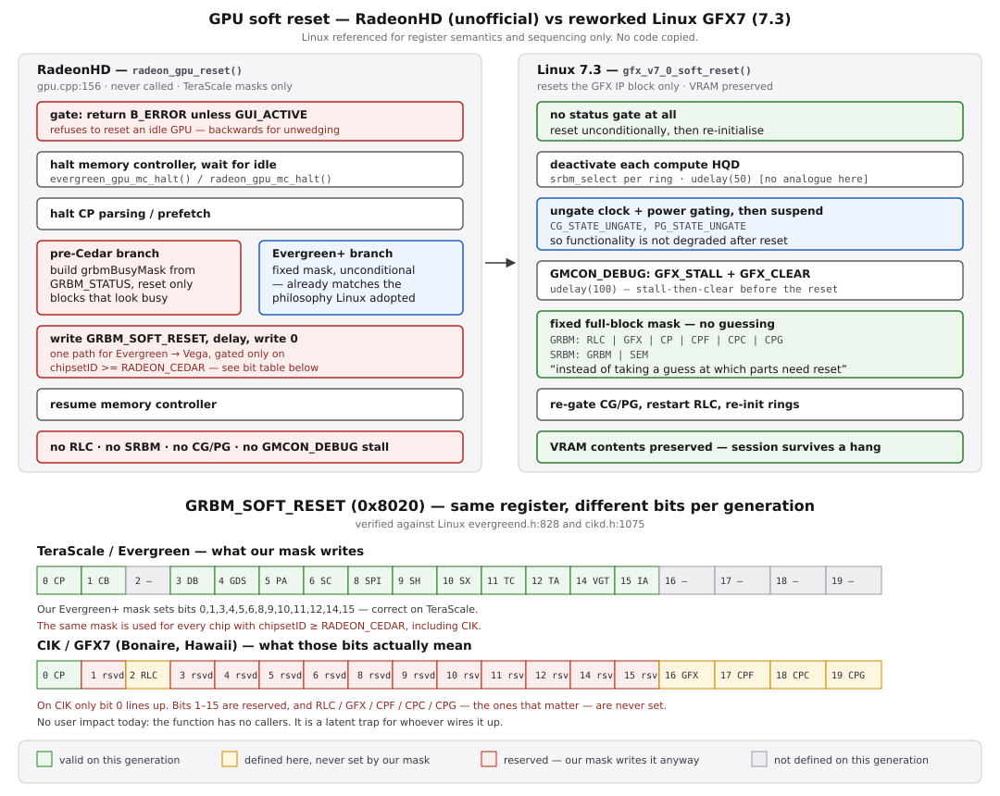

# GPU soft reset — review against the Linux GFX7 rework

**Status:** reviewed, then acted on. `radeon_gpu_reset()` and its `SOFT_RESET_*`
defines were deleted (option 1 of §7); TODO item 15 is closed. Sections 3–5
describe the code as it stood before removal, and are kept because they record
*why* it went.
**Trigger:** Timur Kristóf's *"drm/amdgpu/gfx7: Use GFX IP block soft reset on
GFX7"* series (v2, 2026-07-21, landing in Linux 7.3), plus the GFX6 follow-up of
2026-08-03. Covered by Phoronix as
[AMD GFX7 Soft Reset Linux 7.3](https://www.phoronix.com/news/AMD-GFX7-Soft-Reset-Linux-7.3).

Linux is referenced here for **register semantics and sequencing logic only**.
No code is copied.



---

## 1. What Linux changed

The series makes GPU recovery on GFX7 (CIK / Sea Islands) reset **only the GFX IP
block** rather than the whole GPU, so VRAM contents survive. From the cover
letter:

> GFX IP block soft reset has been implemented as recovery method so that we can
> have a way to reset just the GFX block without resetting the whole GPU or
> losing the contents of VRAM.

It fixes two user-visible problems: Kaveri and Kabini had *no* working recovery
at all (a hang required a physical reset), while Hawaii and Bonaire recovered
only by clearing VRAM, so one hanging application took down the whole graphical
session.

Tested by the author on Bonaire (HD 7790), Hawaii (R9 390X) and Kaveri
(A10-7850K). Nine patches, touching `gfx_v7_0.c`, `amdgpu_gfx.c`, `amdgpu_vm.c`.

## 2. Applicability to this driver: mostly none

Seven of the nine patches concern **command submission** — MQD/HQD setup,
compute rings, `COND_EXEC`, `SWITCH_BUFFER` packets, `CLEAR_STATE`, ring cleanup
during reset. This driver is modesetting-only: it programs CRTCs, encoders, PLLs
and the memory controller, and never submits work to a ring. There is nothing to
port from those.

Two patches — *"Fixup IP block soft reset"* (8/9) and the clock/power-gating
rework folded into it — contain lessons that do transfer. They are below.

## 3. Finding 1 — `radeon_gpu_reset()` is dead code, and wrong past TeraScale

### 3.1 It has no callers

| Where | What |
| --- | --- |
| `src/add-ons/accelerants/radeon_hd/gpu.cpp:156` | definition |
| `src/add-ons/accelerants/radeon_hd/gpu.h:173` | declaration |
| `docs/technical-documentation.md:423` | described as "full GPU reset path" |
| — | **no call site anywhere in the tree** |

Upstream Haiku is the same, and records why: `bios.cpp:176` in the upstream
accelerant contains

```
// radeon_gpu_reset();	// <= r500 only?
```

so the only historical caller was commented out, with an unresolved question
about which hardware it was ever valid for. Our fork inherited the function
without the call.

### 3.2 The register layout it writes is TeraScale-only

`GRBM_SOFT_RESET` lives at `0x8020` on both TeraScale and CIK, but the bit
assignments are almost entirely different. Verified against Linux's own headers,
`drivers/gpu/drm/radeon/evergreend.h:828` and `drivers/gpu/drm/radeon/cikd.h:1075`:

| Bit | Evergreen (TeraScale) | CIK (GFX7) |
| --- | --- | --- |
| `1 << 0` | `SOFT_RESET_CP` | `SOFT_RESET_CP` — *all* CP blocks |
| `1 << 1` | `SOFT_RESET_CB` | — |
| `1 << 2` | — | **`SOFT_RESET_RLC`** |
| `1 << 3` | `SOFT_RESET_DB` | — |
| `1 << 5` | `SOFT_RESET_PA` | — |
| `1 << 6` | `SOFT_RESET_SC` | — |
| `1 << 8`–`1 << 14` | `SPI`, `SH`, `SX`, `TC`, `TA`, `VC`, `VGT` | — |
| `1 << 16` | — | **`SOFT_RESET_GFX`** |
| `1 << 17` | — | **`SOFT_RESET_CPF`** (fetcher, gfx + compute) |
| `1 << 18` | — | **`SOFT_RESET_CPC`** (compute, MEC1/2) |
| `1 << 19` | — | **`SOFT_RESET_CPG`** (gfx: PFP, ME, CE) |

Our `gpu.h:153-168` defines the TeraScale set, and `gpu_reset()`'s "Evergreen and
higher" branch is gated only on `info.chipsetID >= RADEON_CEDAR` — one code path
covering Evergreen, Northern Islands, Southern Islands, **CIK (Bonaire, Hawaii)**,
Volcanic Islands, Polaris and Vega.

Consequence on a CIK part such as our Bonaire test card: the mask sets bits 1, 3,
4, 5, 6, 8–12, 14 and 15, which are reserved on that generation, while leaving
`RLC` (bit 2), `GFX` (16), `CPF` (17), `CPC` (18) and `CPG` (19) untouched. Only
bit 0 (`CP`) happens to line up. Whatever the intent, on GFX7 the function would
reset almost nothing it means to and poke a dozen reserved bits doing it.

**There is no user-visible impact today, because nothing calls it.** It is a
latent trap for whoever wires it up.

## 4. Finding 2 — "reset everything, don't guess" replaces status-driven masks

Patch 8/9's rationale:

> In practice, this means that it will now reset everything in the GFX IP block
> (instead of taking a guess at which parts need to be reset) to make it
> consistent

The patch deletes the read-`GRBM_STATUS`, build-a-busy-mask, reset-only-what-looks-busy
approach in favour of an unconditional, fixed mask.

Our function contains both styles:

- **Pre-Cedar branch** (`gpu.cpp:~180-250`) is exactly the deleted pattern: ~30
  lines assembling `grbmBusyMask` and `grbm2BusyMask` from status bits, then
  resetting only if something reads busy.
- **Evergreen+ branch** (`gpu.cpp:~256-282`) already uses a fixed mask, which is
  the philosophy Linux converged on.

So if this function is ever revived, the newer half is the right model and the
older half is the approach upstream just discarded as unreliable.

### 4.1 The idle guard is backwards for the likely use case

`gpu.cpp:160`:

```
if ((Read32(OUT, GRBM_STATUS) & GUI_ACTIVE) == 0)
	return B_ERROR;
```

This refuses to reset a GPU that is *idle*. If the purpose is unwedging a GPU
left in a bad state by firmware or a previous OS — which is what the
commented-out `bios.cpp` call implies — `GUI_ACTIVE` may well be clear precisely
when a reset is wanted. Linux's reworked path gates on nothing at all; it resets
and then re-initialises.

## 5. Finding 3 — clock/power gating around reset (a constraint for the PM work)

The new code ungates before resetting and lets the IP block's own callbacks
handle it, deleting the bespoke `gfx_v7_0_update_cg()` helper:

```
set_clockgating_state(ip_block, AMD_CG_STATE_UNGATE);
set_powergating_state(ip_block, AMD_PG_STATE_UNGATE);
suspend(ip_block);
```

stated purpose being to "make sure not to degrade GPU functionality after a GFX
IP block soft reset". The deleted helper carried an explicit `/* order matters! */`
comment: enabling went MGCG then CGCG, disabling went CGCG then MGCG.

This driver manages no clock or power gating, so **nothing is wrong today**. It
is a constraint to bank for `power-management-investigation.md`: if `powerplay.cpp`
ever gains gating control, any block reset must ungate first, restore after, and
respect that ordering. Worth noting the GFX7 code also sets `GMCON_DEBUG`
`GFX_STALL`/`GFX_CLEAR` and delays before touching `GRBM_SOFT_RESET` — a
stall-then-clear step our sequence has no equivalent of.

## 6. What is deliberately *not* proposed

- **Porting GFX block reset.** A display-only driver has no ring to recover, so a
  GFX reset has no caller by design. Adding one would be scope creep against
  `feedback_radeon_driver_only_scope`.
- **Implementing GPU recovery.** Haiku's accelerant has no hang detection, no
  fence timeouts and no submission path to retry — the prerequisites do not
  exist.
- **SRBM reset.** `SRBM_SOFT_RESET` is defined at `gpu.h:152` and unused. Linux's
  new sequence resets `GRBM` and `SEM` through it, but that only matters once
  there is something to recover.

## 7. Recommendation

Resolve the dead code rather than port anything. Two options:

1. **Delete** `radeon_gpu_reset()`, the `SOFT_RESET_*` defines at
   `gpu.h:153-168`, and the unused `SRBM_SOFT_RESET` at `gpu.h:152`; drop the
   claim at `technical-documentation.md:423`. Cleanest, and consistent with the
   driver's display-only scope.
2. **Keep it gated and labelled** — restrict it to TeraScale, add a comment that
   it is unused and that the masks are invalid on GFX7+, and correct the doc.

Option 1 is preferred. It also removes one of the last references to
command-processor state from a driver that otherwise has none, alongside TODO
items 9 and 10 (the `#if 0` ring/MC blocks and the `radeon_gpu_ring_boot()`
stub) — the three are best cleaned up together.

Whichever is chosen, `technical-documentation.md:423` should stop presenting the
function as a working "full GPU reset path".
