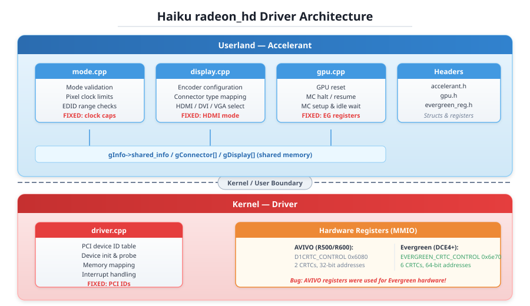
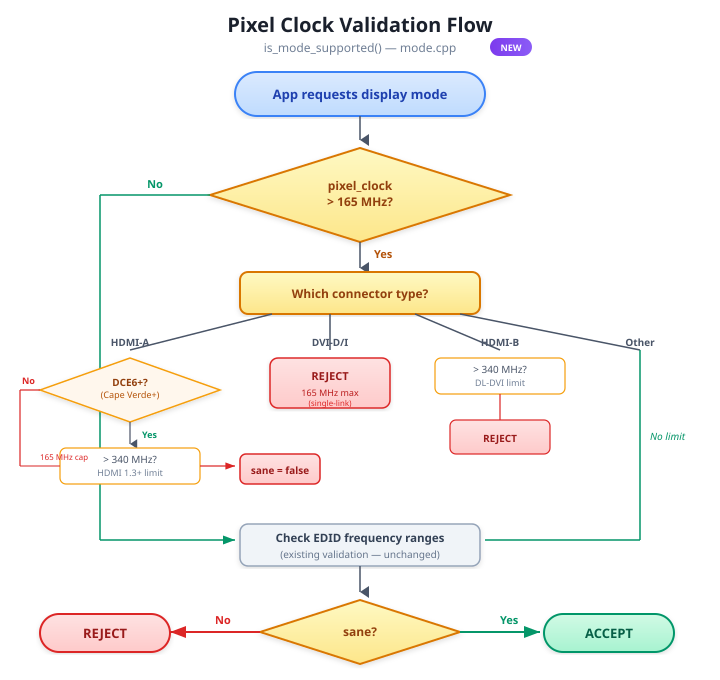
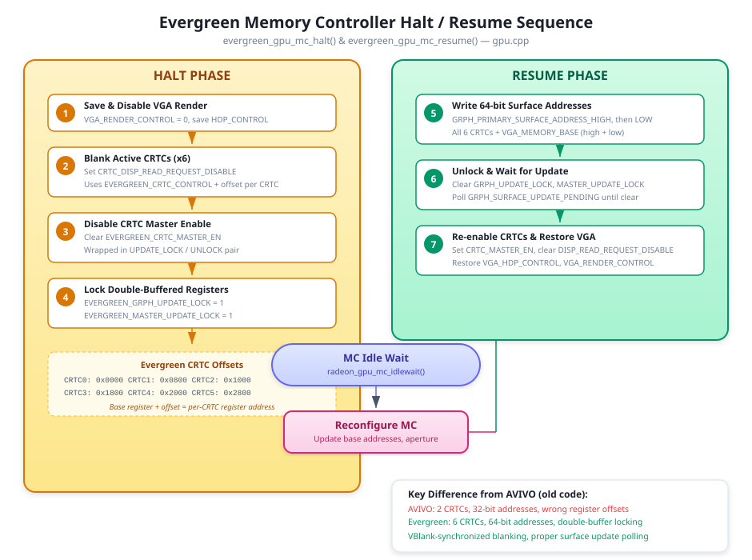
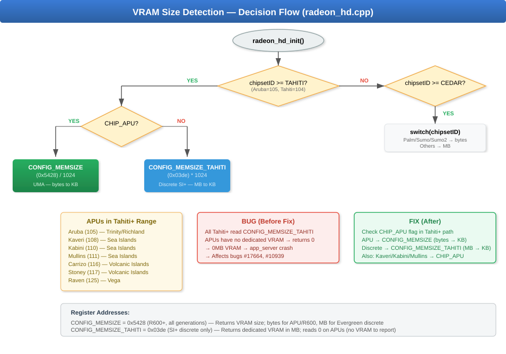
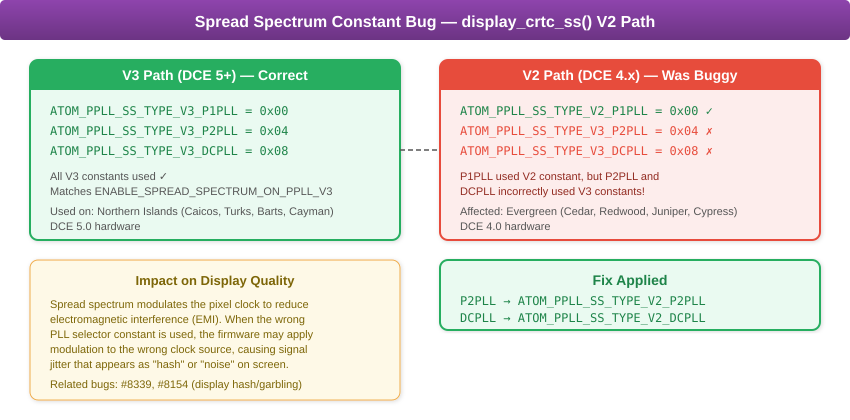
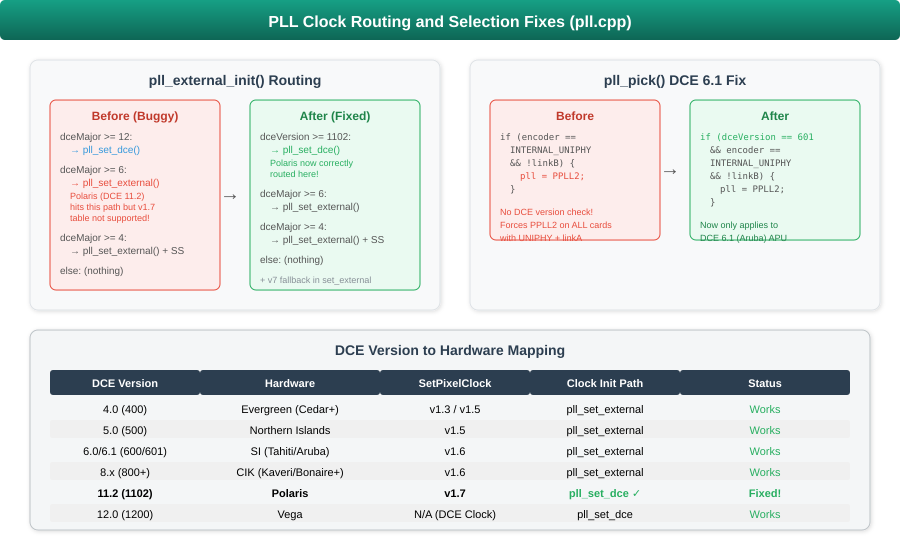
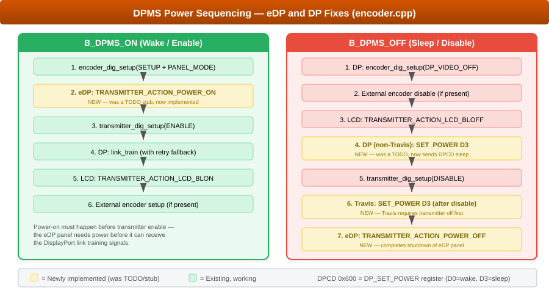
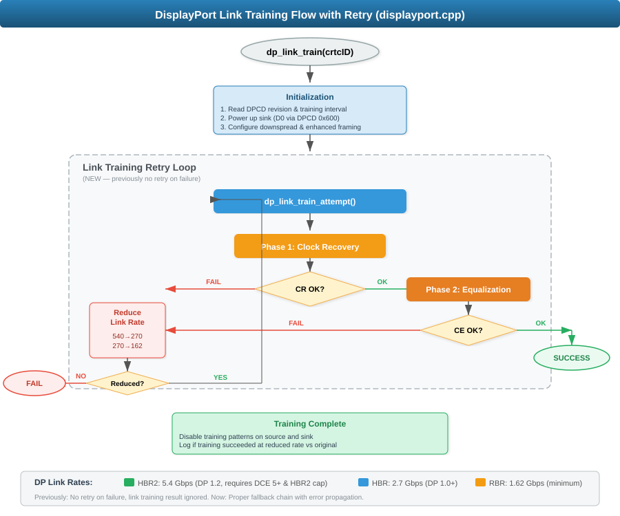

>[!NOTE]
>An LLM was used to aid in development of this code.


# RadeonHD (Unofficial) — Technical Documentation

This document is the consolidated technical reference for the RadeonHD
(unofficial) fork. It walks through every shipped fix.

> Repository: [https://github.com/KevinAdams05/RadeonHDunofficial](https://github.com/KevinAdams05/RadeonHDunofficial)

---

## Table of Contents

- [Hardware Generations Affected](#hardware-generations-affected)
- [Driver Architecture Recap](#driver-architecture-recap)
- [Packaging Constraint — Kernel↔Accelerant ABI Lockstep](#packaging-constraint--kernelaccelerant-abi-lockstep)
- [0.1.0 — Cedar / Evergreen HDMI Corruption](#010--cedar--evergreen-hdmi-corruption)
  - [Pixel Clock Validation Per Connector Type](#pixel-clock-validation-per-connector-type)
  - [Wrong Memory Controller Registers for Evergreen GPUs](#wrong-memory-controller-registers-for-evergreen-gpus)
  - [HDMI-A Encoder Mode Returned DVI](#hdmi-a-encoder-mode-returned-dvi)
  - [PCI ID Misidentification and Missing IDs](#pci-id-misidentification-and-missing-ids)
- [0.2.0 — HDMI Guard-Band Magenta Stripe](#020--hdmi-guard-band-magenta-stripe)
- [0.3.0 — APU, PLL, DPMS, DisplayPort](#030--apu-pll-dpms-displayport)
  - [APU VRAM Misdetection](#apu-vram-misdetection)
  - [Chip Flag Corrections](#chip-flag-corrections)
  - [Spread Spectrum Constant Bug](#spread-spectrum-constant-bug)
  - [PLL Clock Routing](#pll-clock-routing)
  - [DPMS / eDP Power Sequencing](#dpms--edp-power-sequencing)
  - [DisplayPort Link Training](#displayport-link-training)
- [0.4.0 — EDID Parser, Forced Linear Scanout, and Caicos Cap](#040--edid-parser-forced-linear-scanout-and-caicos-cap)
  - [EDID Range Parser Hardening](#edid-range-parser-hardening)
  - [Forced Linear-Aligned Scanout](#forced-linear-aligned-scanout)
  - [Caicos High-Bandwidth Mode Cap](#caicos-high-bandwidth-mode-cap)
- [0.5.0 — Turks Cap and Square-Mode Filter](#050--turks-cap-and-square-mode-filter)
- [0.6.0 — DP/PLL Polish and HDMI Infoframe Groundwork](#060--dppll-polish-and-hdmi-infoframe-groundwork)
- [0.6.1 — HD 6850 (Barts) Re-enabled](#061--hd-6850-barts-re-enabled)
- [0.6.2 — Barts Pixel-Clock Cap](#062--barts-pixel-clock-cap)
- [0.6.3 — HDMI Magenta Stripe Root Cause: the Wrong DIG](#063--hdmi-magenta-stripe-root-cause-the-wrong-dig)
  - [Bug 1 — AFMT block indexed by CRTC id instead of DIG id](#bug-1--afmt-block-indexed-by-crtc-id-instead-of-dig-id)
  - [Bug 2 — fabricated AFMT offset table](#bug-2--fabricated-afmt-offset-table)
  - [Bug 3 — byte-shifted AVI infoframe packing](#bug-3--byte-shifted-avi-infoframe-packing)
  - [The elimination ladder](#the-elimination-ladder-test-builds-all-on-the-ax5450)
- [0.6.3 — Kernel Hardening, DCN Guard, and Instrumentation](#063--kernel-hardening-dcn-guard-and-instrumentation)
- [Proposed: AtomBIOS Robustness](#proposed-atombios-robustness)
- [Proposed: R600/R700 Hardening](#proposed-r600r700-hardening)
- [Proposed: NI/Polaris Extensions](#proposed-nipolaris-extensions)
- [Proposed: `B_MOVE_DISPLAY` Enhancement](#proposed-b_move_display-enhancement)
- [Bug Tracker Cross-Reference](#bug-tracker-cross-reference)
- [Files Modified — Complete List](#files-modified--complete-list)
- [Reference: Linux Radeon Driver](#reference-linux-radeon-driver)

---

## Hardware Generations Affected

| Generation | DCE | Codename Examples | Potential Test GPU | Potential Test CPU (APU) | Versions |
|------------|-----|-------------------|--------------------|--------------------------|----------|
| **R600** | 1.0 / 2.0 | R600, RV610, RV620, RV630, RV635, RV670, RS780/RS880 (IGP) | **NEED:** HD 2400 PRO **and** HD 3450 (direct match for [#11242] [#11907] [#19166]). Optional: HD 2600 (RV630, [#12970] [#12642]) | — | — |
| **R700** | 3.0 / 3.2 | RV710, RV730, RV740, RV770 | **NEED:** HD 4670 (direct match for [#8457] [#15125]). Optional: HD 4350/4550 , HD 4870  | — | — |
| Evergreen | 4.x | Cedar, Redwood, Juniper, Cypress | **✅ HD 5450 (`0x68f9`, Cedar).** NEXT: HD 5770 (Juniper) or HD 5870 (Cypress), HD 5670 (Redwood XT — to reproduce [#19934]) | — | 0.1.0, 0.2.0, 0.3.0, 0.4.0 |
| Northern Islands | 5.x | Caicos, Turks, Barts, Cayman | **✅ HD 7470/8470 OEM (`0x6778`, Caicos XT).** **✅ HD 6570/7570/8550/R5 230 (`0x6759`, Turks PRO).** **✅ HD 6850 (`0x6739`, Barts PRO)** Need: HD 6950 (Cayman) | — | 0.3.0, 0.4.0 (Caicos cap), 0.5.0 (Turks cap), 0.6.1 (Barts re-enable), 0.6.2 (Barts cap) |
| Southern Islands | 6.x | Cape Verde, Pitcairn, Tahiti, **Aruba (APU)** | **✅ HD 7770 / R7 250X (`0x683d`, Cape Verde XT, MSI board) — DVI-I + HDMI + DisplayPort at 1920×1200@60 (first SI/DCE6 part tested; DP HPD path `SI_DC_GPIO_HPD_A` already correct, DP clock fix applies). HDMI tops out at 1920×1200 here — no 4K@60 (HDMI 1.4, 340 MHz cap; see the HDMI note).** Need: HD 7870 (Pitcairn), HD 7970 (Tahiti) | A10-5800K / A8-5600K (Trinity) **or** A10-6800K / A8-6600K (Richland) on Socket FM2  | 0.3.0, 0.4.0, 0.6.4 (Cape Verde verified) |
| Sea Islands | 8.x | Bonaire, Hawaii, **Kaveri/Kabini/Mullins (APU)** | **✅ R7 260X / 360 (`0x6658`, Bonaire XTX, MSI board) — first GCN/CIK part tested; HDMI + DisplayPort verified. (A pre-release build briefly showed 4K@60 over HDMI via AtomBIOS 4:2:0 halving; the shipping driver caps HDMI at 340 MHz like Linux, so 4K@60 is a DisplayPort mode — see the HDMI note.)** Need: R9 290/290X (Hawaii) | A10-7860K / A10-7850K (Kaveri, Socket FM2+), Athlon 5350 / Sempron 3850 (Kabini, Socket AM1), or any Mullins laptop (e.g. A4 Micro-6400T) | 0.3.0, 0.4.0, 0.6.4 (Bonaire verified) |
| Volcanic Islands | 10.0 / 11.0 / 11.1 | Tonga, Fiji, **Carrizo (APU)**, **Stoney (APU)** | R9 285 (Tonga), R9 Fury (Fiji) | Carrizo laptop: FX-8800P, A10-8700P, A8-8600P. Stoney laptop: A9-9410, A6-9220, E2-9000. | 0.3.0, 0.4.0 |
| Polaris | 11.2 | Polaris10, Polaris11, Polaris12, Polaris22 | **RX 580** / RX 590 (Polaris10), RX 460 / RX 560 (Polaris11), or RX 540 / RX 550 (Polaris12) | — | 0.3.0, 0.4.0 |


Barts (256-bit memory bus) was capped at 340 MHz in 0.6.2 after
4K@60Hz over DisplayPort produced the same stride-aliased corruption
seen on the narrower-bus Caicos and Turks chips — wider bus did not
eliminate the architectural ceiling, only raised it. Cayman (also
256-bit bus, same DCE 5 generation as Barts) shares the scanout
architecture but is left uncapped pending hardware testing. See the
0.4.0, 0.5.0, 0.6.1, and 0.6.2 sections for the full investigation.


### Notes on choosing test cards

- **Within a chip pair the bin doesn't matter for the driver.** HD 6850
  vs HD 6870 are both `RADEON_BARTS` — same code path, same registers,
  just different clock bin. Same for HD 6950 vs HD 6970 (both
  `RADEON_CAYMAN`). Buy whichever is cheaper used.
- **Look for DisplayPort-equipped cards** when targeting 4K-class tests.
  Barts and Cayman launched with DP 1.2 (HBR2 5.4 Gbps) which is
  sufficient for 4K@60Hz at the link layer. The DVI/HDMI outputs on
  these cards are limited to HDMI 1.4a (4K@30Hz max), which would
  defeat the bandwidth-ceiling test.

Bold entries are integrated GPUs (APUs) sharing system RAM via UMA — these
are particularly impacted by the VRAM-detection and chip-flag fixes in
0.3.0.

## What cards are in scope

Cards considered in scope are the DCE family of cards which is roughly R600 (HD 2900) through Polaris12 (RX 540 / 550). See the **PCI ID Quick-Reference** list below.

The fork stops at **Polaris (DCE 11.2, 2016–17)**. Anything newer uses
AMD's **DCN** (Display Core Next) display engine, which bypasses
AtomBIOS entirely and would require a separate Haiku driver
(`radeon_dcn` or similar) to support. See
[`dce-vs-dcn-driver-boundaries.md`](dce-vs-dcn-driver-boundaries.md)
for the full architectural argument.

### PCI ID Quick-Reference


| Codename | Card / CPU | PCI ID range |
|----------|------------|--------------|
| R600 | HD 2900 | `0x9400`–`0x940F` |
| RV610 | HD 2400 PRO/XT | `0x94C0`–`0x94CF` |
| RV630 | HD 2600 PRO/XT | `0x9580`–`0x958F` |
| RV620 | HD 3450 / 3470 | `0x95C0`–`0x95CF` |
| RV635 | HD 3650 / 3690 | `0x9590`–`0x959F` |
| RV670 | HD 3850 / 3870 | `0x9500`–`0x950F` |
| RS780/RS880 | HD 3200 / 4250 / 4290 (IGPs) | `0x9610`–`0x963F`, `0x9710`–`0x971F` |
| RV710 | HD 4350 / 4550 | `0x954F`, `0x9540`, `0x9555` |
| RV730 | HD 4650 / 4670 | `0x9498`–`0x949F` |
| RV740 | HD 4750 / 4770 | `0x94A0`, `0x94A1`, `0x94B3`–`0x94B5` |
| RV770 | HD 4850 / 4870 | `0x9440`–`0x9462` |
| Cedar | HD 5450 / 6350 / 7350 | `0x68E0`–`0x68FF` (esp. `0x68F9`, `0x68FA`) |
| Redwood | HD 5670 / 5570 | `0x68C0`–`0x68DF` |
| Juniper | HD 5750 / 5770 | `0x68B0`–`0x68BF` |
| Cypress | HD 5850 / 5870 | `0x6898`–`0x68A8` |
| Caicos | HD 7470 / 8470 OEM | `0x6760`–`0x677F` (esp. `0x6778`) |
| Turks | HD 6570 / 6670 | `0x6740`–`0x675F` |
| Barts | HD 6850 / 6870 | `0x6738`–`0x673F` |
| Cayman | HD 6950 / 6970 | `0x6718`–`0x6720` |
| Cape Verde | HD 7750 / 7770 | `0x6820`–`0x683F` |
| Pitcairn | HD 7850 / 7870 | `0x6800`–`0x681F` |
| Tahiti | HD 7950 / 7970 | `0x6798`–`0x679E` |
| Aruba | A10-5800K / 6800K APU | `0x9900`–`0x9907` |
| Bonaire | R7 260 / 260X | `0x6650`–`0x665F` |
| Hawaii | R9 290 / 290X | `0x67A0`–`0x67BF` |
| Tonga | R9 285 / 380 | `0x6920`–`0x6939` |
| Fiji | R9 Fury / Nano | `0x7300`–`0x730F` |
| Kaveri | A10-7850K / 7860K APU | `0x1304`–`0x131D` |
| Kabini | Athlon 5350 APU | `0x9830`–`0x983D` |
| Mullins | A4 Micro-6400T APU | `0x9850`–`0x9877` |
| Carrizo | FX-8800P / A10-8700P APU | `0x9874` |
| Stoney | A9-9410 / A6-9220 APU | `0x98E4` |
| Polaris10 | RX 470 / 480 / 570 / 580 / 590 | `0x67C0`–`0x67FF` |
| Polaris11 | RX 460 / 560 | `0x67E0`–`0x67EF` (within the P10 range) |
| Polaris12 | RX 540 / 550 | `0x6980`–`0x699F` |


### Out of scope cards
For reference, **NOT in scope for `radeon_hd`** — these IDs should belong to a future `radeon_dcn` driver:

| Codename | Card / CPU | PCI ID range | Display engine |
|----------|------------|--------------|----------------|
| Vega10 | RX Vega 56 / 64 | `0x6860`–`0x687F` | DCE 12.0 (late DCE, not practically supported) |
| Raven / Raven2 | Ryzen 2200G / 2400G / 2x00U / 3x00U | `0x15D8`, `0x15DD`, `0x15D9` | **DCN 1.0** |
| Picasso | Ryzen 3200G / 3400G refresh | `0x15D8` | **DCN 1.0** |
| Navi10 | RX 5500 / 5600 / 5700 | `0x7310`–`0x731F` | **DCN 1.0** |
| Renoir / Lucienne | Ryzen 4x00U / 5x00U mobile | `0x1636`–`0x164C` | **DCN 2.x** |
| Navi2x | RX 6x00 series | `0x73A0`–`0x73FF` | **DCN 2.x** |
| Navi3x | RX 7x00 series | `0x73DF`+ | **DCN 3.x** |

If `listdev` shows one of these on a machine you're trying to support,
the right answer is this fork won't help.


| Generation | DCE/DCN | Codename Examples | Why excluded from this fork |
|------------|---------|-------------------|------------------------------|
| Vega (discrete) | DCE 12.0 | Vega10 (RX Vega 56/64) | Late-stage DCE that the existing radeon_hd code paths don't cover; the Vega10 register layout drifted significantly from Polaris. Technically in `radeon_hd`'s "DCE-era" bucket but not practically supportable here. |
| Vega APU | DCN 1.0 | Raven Ridge (Ryzen 2200G/2400G), Picasso (Ryzen 3200G/3400G) | DCN-class display engine — needs a future `radeon_dcn` driver. The Vega-class GFX9 shaders share a name with discrete Vega but the **display engine is DCN**, not DCE. |
| Vega APU (mobile) | DCN 1.0 | Ryzen 2x00U / 3x00U "Raven2" (HP ProBook 445 G6, ThinkPad E495, Acer Aspire 5 — see laptop note above) | Same chip family as desktop Raven; DCN. The laptops in the wifi-test note are useful for **wifi testing only**, not radeon_hd graphics testing. |
| RDNA1 | DCN 1.0 | Navi10 (RX 5500/5600/5700) | DCN |
| RDNA2 / Renoir | DCN 2.x | Renoir (Ryzen 4x00U/5x00U), Lucienne, Navi2x (RX 6x00) | DCN |
| RDNA3 | DCN 3.x | Navi3x (RX 7x00) | DCN |


---

## Driver Architecture Recap

The Haiku `radeon_hd` driver is split across two layers:

| Component | Path | Runs in | Responsibilities |
|-----------|------|---------|------------------|
| **Kernel driver** | `src/add-ons/kernel/drivers/graphics/radeon_hd/` | Kernel space | PCI device enumeration, MMIO mapping, VRAM detection, interrupt delivery |
| **Accelerant** | `src/add-ons/accelerants/radeon_hd/` | User space | Mode setting, GPU memory controller programming, encoder/PLL configuration, DP link training |

The two halves communicate through the standard Haiku graphics ioctl interface
and a shared memory region containing the chipset descriptor. They must be
ABI-compatible — i.e., always built from the same source tree — because the
shared structures (`evergreen_gpu_state`, etc.) are defined once and used by
both sides.



---

## Packaging Constraint — Kernel↔Accelerant ABI Lockstep

This is a hard rule for distributing the fork as a `.hpkg`, and for any
hand-installation that bypasses the package manager.

### Why It Matters

The kernel driver allocates an `accelerant_info` struct (declared in
`headers/private/graphics/radeon_hd/accelerant.h`) and exposes it to the
userland accelerant via `clone_area`. Both halves dereference fields off
that struct directly — there is no marshalling layer, no version
negotiation, and no padding/reserved-space discipline that would let the
two sides drift independently.

The fork's initial 0.1.0 patch added an `evergreen_gpu_state` member to
`accelerant_info` to hold the saved CRTC state used by the new
Evergreen-specific MC halt/resume path. That changes the in-memory
layout of `accelerant_info` versus the stock Haiku build:

```
              Stock build              Fork build
              ───────────              ──────────
              accelerant_info {        accelerant_info {
                  ... shared ...           ... shared ...
                  shared_info* si;         shared_info* si;
                  area_id area_*;          area_id area_*;
                  // (end)              +  evergreen_gpu_state evgState;
              }                        }
```

If the kernel driver and accelerant are built from different trees, the
side that allocated the struct and the side that maps it disagree on
total size, field offsets, or both. Reads and writes after the divergence
point land on garbage memory. Symptoms range from immediate crash on
first `B_ACCELERANT_OPEN` to silent corruption of CRTC state during the
first mode set.

### Scope of the Constraint

| Header changed | Cross-binary contract? | Mixing risk |
|----------------|------------------------|-------------|
| `accelerant.h` (`accelerant_info` struct) | **Yes** | High — layout disagreement → crash/corruption |
| `evergreen_reg.h` (register defines) | No — values compile into binaries | None |

Only `accelerant.h` is load-bearing here. Pure register-define headers
have no cross-binary ABI surface. Future patches that touch
`accelerant.h` (or any other shared struct in the private header tree)
must be evaluated against this same constraint.

### Distribution Rules

1. **Ship both binaries in the same `.hpkg`, built from the same source
   tree.** Never publish a release that contains only the kernel driver
   or only the accelerant.
2. **Use install paths that override both atomically.** The
   `~/config/non-packaged/...` paths in the README satisfy this — the
   loader picks user paths first for both, so either both override or
   neither does.
3. **Do not document or recommend hand-copying individual files.** A
   user who copies just `radeon_hd.accelerant` from the fork on top of a
   stock kernel driver (or vice versa) will produce the exact mixed-ABI
   crash this section warns about.
4. **If a future v2 packaging uses `PROVIDES: radeon_hd compat>=...`**
   semantics with conflict declarations against the stock package, the
   atomic unit must still be both binaries together.

### Why a Cleaner Cross-Binary Contract Wasn't Used

`accelerant_info` is private to radeon_hd and has always been treated as
internal — it is not part of any documented Haiku API and there is no
ABI version field. Adding versioning machinery now would be more
disruptive than the current rule (ship-both-together), because the
struct is consumed in dozens of places across the accelerant. The
ship-both rule costs nothing in practice — both binaries always travel
together anyway — and avoids any change to the in-tree convention.

---

## 0.1.0 — Cedar / Evergreen HDMI Corruption

**Symptom.** Cedar-class Radeon GPUs (HD 5400 / 6300 / 7300) connected via HDMI
displayed a garbled/corrupted image under Haiku. The display would appear
scrambled, with pixel data visibly wrong despite the monitor receiving a
signal. Affected real hardware including PCI IDs like `0x68f9` (HD 5450), and
was especially noticeable when the system attempted higher resolutions.

**Root cause.** Four independent bugs combined to produce the corruption.
Individually any one of them might have caused only subtle issues, but
together they guaranteed corruption on Cedar HDMI setups.

### Pixel Clock Validation Per Connector Type

**File:** `src/add-ons/accelerants/radeon_hd/mode.cpp`

#### Problem

The `is_mode_supported()` function had no awareness of physical connector
bandwidth limits. It would happily accept a 4K@60Hz mode (requiring
~533 MHz pixel clock) on a Cedar GPU over HDMI, even though HDMI single-link
TMDS maxes out at 165 MHz on pre-DCE6 hardware.

Without this validation, the driver would attempt to program impossible pixel
clocks. The PLL would either fail to lock, lock on a harmonic, or produce a
clock that the encoder could not transport correctly — all of which manifest
to the user as "garbled display."

#### Fix

Added pixel clock validation that enforces:

| Connector Type | Max Pixel Clock | Notes |
|----------------|----------------|-------|
| HDMI-A (pre-DCE6) | 165 MHz | Single-link TMDS limit |
| HDMI-A (DCE6+) | 340 MHz | HDMI 1.3+ support |
| DVI-D / DVI-I | 165 MHz | Single-link; dual-link not yet distinguished |
| HDMI-B | 340 MHz | Electrically dual-link DVI |

Modes exceeding the limit are now rejected by `is_mode_supported()` before
they ever reach the PLL programming path.

**Why there is no 4K@60 over HDMI on any card this driver supports.**
Full-RGB 4K@60 is a ~594 MHz TMDS clock, which requires HDMI 2.0. Every GPU
in scope here is HDMI 1.4a, whose transmitter caps at 340 MHz — a limit of
the GPU silicon, not the cable (HDMI cables have no version; any High Speed
cable already carries more than 340 MHz). The only way to fit 4K@60 into
HDMI 1.4 is YCbCr **4:2:0**, which halves the chroma data to ~266 MHz. That
is an `amdgpu`/DC-era feature; the old Linux `radeon` driver never
implemented it, and neither does this fork. The 340 MHz cap above therefore
matches Linux `radeon` exactly — `radeon_dvi_mode_valid()` returns
`MODE_CLOCK_HIGH` for HDMI modes over 340 MHz on DCE6+ and has no 4:2:0
path. Full-RGB 4K@60 on these cards is a **DisplayPort** capability
(DP 1.2/HBR2 has the bandwidth), not an HDMI one.



### Wrong Memory Controller Registers for Evergreen GPUs

**File:** `src/add-ons/accelerants/radeon_hd/gpu.cpp`

#### Problem

The driver used **AVIVO-era** (R500/R600) memory controller halt/resume
functions for **all** GPU generations, including Evergreen (DCE4+). The
AVIVO functions use register addresses like `0x6080` (`D1CRTC_CONTROL`),
which map to completely different (or nonexistent) functions on Evergreen
hardware, where the correct CRTC base is `0x6e70`
(`EVERGREEN_CRTC_CONTROL`).

The cascading consequences were:

- The old code only handled 2 CRTCs; Evergreen supports up to 6.
- AVIVO surface address registers are 32-bit; Evergreen uses 64-bit (high +
  low pair).
- Writing to wrong register addresses during MC halt/resume corrupted display
  state non-deterministically.
- No double-buffer locking meant surface address updates could tear.

#### Fix

Added dedicated `evergreen_gpu_mc_halt()` and `evergreen_gpu_mc_resume()`
functions that:

- Use the correct Evergreen register addresses for all operations.
- Handle all 6 CRTCs via the standard offset table.
- Properly lock/unlock double-buffered registers (`GRPH_UPDATE_LOCK`,
  `MASTER_UPDATE_LOCK`).
- Write 64-bit surface addresses (high word first, then low — required by
  the hardware double-buffer latch).
- Use VBlank-synchronized blanking via `CRTC_DISP_READ_REQUEST_DISABLE`.
- Wait for the surface-update-pending bit to clear before re-enabling CRTCs.

Two callers were updated to use the Evergreen-specific path when
`chipsetID >= RADEON_CEDAR`:

- `radeon_gpu_reset()` — full GPU reset path.
- `radeon_gpu_mc_setup_evergreen()` — MC base address reconfiguration path.

Saved/restored CRTC state lives in a new `evergreen_gpu_state` struct
declared in `accelerant.h`, sized to hold per-CRTC control words and surface
address pairs for all 6 CRTCs.



### HDMI-A Encoder Mode Returned DVI

**File:** `src/add-ons/accelerants/radeon_hd/display.cpp`

#### Problem

In `display_get_encoder_mode()`, the `VIDEO_CONNECTOR_HDMIA` case fell
through to the default and returned `ATOM_ENCODER_MODE_DVI`. HDMI connectors
were therefore configured as DVI encoders, suppressing HDMI-specific
signaling (no audio capability, wrong infoframes, no AVI infoframe at all).

```
Before (simplified):
  case VIDEO_CONNECTOR_DVID:
  case VIDEO_CONNECTOR_HDMIA:
  default:
      return ATOM_ENCODER_MODE_DVI;   // HDMI treated as DVI

After:
  case VIDEO_CONNECTOR_HDMIA:
      return ATOM_ENCODER_MODE_HDMI;  // Correct HDMI mode
  case VIDEO_CONNECTOR_DVID:
  default:
      return ATOM_ENCODER_MODE_DVI;
```

#### Caveat (see 0.2.0)

Returning `ATOM_ENCODER_MODE_HDMI` exposed a separate problem: the encoder
emits data-island guard bands during HBLANK, but the HDMI infoframe / audio
packet registers are not yet programmed by the Haiku driver. That guard-band
data is decoded by the receiver as visible pixels, producing a magenta stripe
on the left edge of the active region. **0.2.0 reverts this case to the
DVI fallback** as a conservative measure until full HDMI infoframe support
lands. 0.6.0 adds the AVI-infoframe groundwork but does not yet retire the
fallback (see that section for the open investigation).

### PCI ID Misidentification and Missing IDs

**File:** `src/add-ons/kernel/drivers/graphics/radeon_hd/driver.cpp`

#### Problem 1 — Misidentified chip

PCI ID `0x68fa` was listed as `RADEON_CAICOS` (DCE5, Northern Islands) when
it is actually a **Cedar** chip (DCE4, Evergreen). With the wrong chipset
ID, the driver loads the wrong register sets, takes the wrong power
management paths, and selects the wrong MC programming code (which, until
the Evergreen MC halt/resume fix above, did not exist for Evergreen anyway).

```
Before: {0x68fa, 5, 0, RADEON_CAICOS, ...}
After:  {0x68fa, 4, 0, RADEON_CEDAR,  ...}
```

#### Problem 2 — Missing Cedar PCI IDs

Seven Cedar variants were absent entirely from the device table. Cards with
these IDs would not even bind to the driver:

| PCI ID | Description |
|--------|-------------|
| `0x68e5` | Radeon HD 6300M (Mobile) |
| `0x68e8` | Radeon HD Cedar |
| `0x68e9` | Radeon HD Cedar |
| `0x68f1` | Radeon HD 5450 |
| `0x68f2` | Radeon HD Cedar |
| `0x68f8` | Radeon HD 7300 |
| `0x68fe` | Radeon HD Cedar |

Added all seven to the table with the correct Cedar / DCE4 chipset
descriptors.

---

## 0.2.0 — HDMI Guard-Band Magenta Stripe

**File:** `src/add-ons/accelerants/radeon_hd/display.cpp`
**Commit:** `2f542cc5ed` — *radeon_hd: drive HDMI connectors as DVI until infoframes are implemented*
**Date:** 2026-04-27

### Problem

After 0.1.0's HDMI-A encoder-mode fix began returning `ATOM_ENCODER_MODE_HDMI`
for HDMI-A connectors, real Cedar/Evergreen hardware began producing a
visible magenta stripe on the left edge of the active region.

Root cause: with `ATOM_ENCODER_MODE_HDMI` selected, the AtomBIOS-programmed
encoder begins emitting data-island guard bands during HBLANK. Those guard
bands carry HDMI infoframes and audio packets — *if* the infoframe and audio
packet registers are programmed:

- `HDMI_INFOFRAME_CONTROL0`
- `HDMI_GENERIC_PACKET_CONTROL`
- `HDMI_VBI_PACKET_CONTROL`
- `AFMT_AUDIO_PACKET_CONTROL`

Haiku's driver does not yet program any of these registers for DCE4+. The
encoder ends up emitting *unconfigured* guard bands. The receiver decodes
those guard-band symbols as pixel data, producing the magenta stripe at the
start of every active line.

### Solution

Mirror Linux's behavior: only request `ATOM_ENCODER_MODE_HDMI` when audio is
actually enabled and the infoframe path is functional. Until HDMI audio +
infoframe setup lands for DCE4+, drive HDMI connectors as DVI. HDMI is
electrically backward-compatible with DVI, so video works correctly without
the data island — the only thing missing is HDMI audio, which the driver
does not yet support anyway.

### Why Not Just Program the Infoframe Registers?

Programming infoframes correctly requires AVI/audio infoframe construction,
audio clock recovery setup (ACR), packet pacing, and per-DCE-version
register layout knowledge. That is a meaningful piece of work in its own
right and depends on the audio path being wired up. Treating HDMI as DVI is
the correct **conservative** default — image quality is right, audio is
absent, and the path forward (programming the registers and re-enabling
`ATOM_ENCODER_MODE_HDMI`) does not change.

---

## 0.3.0 — APU, PLL, DPMS, DisplayPort

The 0.3.0 set covers a broader range of generations than 0.1.0, focused
on APUs and DisplayPort.

### APU VRAM Misdetection

**File:** `src/add-ons/kernel/drivers/graphics/radeon_hd/radeon_hd.cpp`
**Priority:** CRITICAL
**Bugs:** [#17664], [#10939], [#18470]

#### Problem

APUs (like AMD Trinity/Richland "Aruba") don't have dedicated VRAM — they
carve a portion of system RAM for GPU use via UMA (Unified Memory
Architecture). The VRAM detection code used a simple enum comparison
`chipsetID >= RADEON_TAHITI` to decide which register to read:

```
VRAM size register selection (BEFORE):
  chipsetID >= TAHITI  →  CONFIG_MEMSIZE_TAHITI (0x03de)  ← reads MB
  chipsetID >= CEDAR   →  CONFIG_MEMSIZE        (0x5428)  ← reads MB or bytes
```

The enum ordering is the trap: `RADEON_ARUBA` (105) comes *after*
`RADEON_TAHITI` (104), so Aruba APUs hit the `>= TAHITI` branch and read
`CONFIG_MEMSIZE_TAHITI`. That register only reports dedicated VRAM — on an
APU with no dedicated VRAM, it returns **zero**. Consequences:

- 0 MB VRAM detection.
- `app_server` crash when trying to map a zero-size framebuffer.
- Complete boot failure on affected hardware.

#### Solution

Added a `CHIP_APU` flag check within the `>= RADEON_TAHITI` path. APUs read
`CONFIG_MEMSIZE` (which reports their UMA allocation in bytes), while
discrete GPUs continue reading `CONFIG_MEMSIZE_TAHITI`.



#### Affected Chipsets

All DCE-era APUs in the Tahiti+ enum range:

| Chipset | Enum | Generation | DCE |
|---------|------|------------|-----|
| Aruba | 105 | Southern Islands | 6.1 |
| Kaveri | 108 | Sea Islands | 8.1 |
| Kabini | 110 | Sea Islands | 8.3 |
| Mullins | 111 | Sea Islands | 8.3 |
| Carrizo | 116 | Volcanic Islands | 11.0 |
| Stoney | 117 | Volcanic Islands | 11.1 |

> Raven (enum 125) is in the chip-family table at the source level but
> uses the **DCN 1.0** display engine, not DCE — so this APU VRAM fix
> doesn't apply to it. Raven and newer APUs are out of scope for the
> `radeon_hd` driver entirely (see "Out of scope" subsection in
> *Hardware Generations Affected* above).

### Chip Flag Corrections

**File:** `src/add-ons/kernel/drivers/graphics/radeon_hd/driver.cpp`
**Priority:** HIGH

#### Problem

Kaveri, Kabini, and Mullins were all tagged as `CHIP_STD` (standard /
discrete) in the PCI device ID table. They are APUs — integrated graphics
sharing system RAM, not discrete GPUs with dedicated VRAM. The incorrect
flag meant:

1. The VRAM detection fix above couldn't help them, since it checks
   `CHIP_APU`.
2. Any other APU-specific code paths were skipped.
3. The PLL fractional feedback divider (set for APUs in `pll_setup_flags`)
   was never enabled.

#### Solution

Changed all Kaveri (24 entries), Kabini (18 entries), and Mullins (16
entries) from `CHIP_STD` to `CHIP_APU` in the PCI device table — 58 entries
total.

### Spread Spectrum Constant Bug

**File:** `src/add-ons/accelerants/radeon_hd/display.cpp`
**Priority:** MEDIUM
**Bugs:** [#8339], [#8154]

#### Problem

The `display_crtc_ss()` function configures spread spectrum modulation on
the pixel clock PLL. Spread spectrum intentionally "wobbles" the clock
frequency slightly to reduce electromagnetic interference (EMI). The
function has two code paths:

- **V3 path** (DCE 5+ / Northern Islands): uses `ATOM_PPLL_SS_TYPE_V3_*`
  constants.
- **V2 path** (DCE 4.x / Evergreen): should use `ATOM_PPLL_SS_TYPE_V2_*`
  constants.

The bug: in the V2 path, `ATOM_PPLL1` correctly used
`ATOM_PPLL_SS_TYPE_V2_P1PLL`, but `ATOM_PPLL2` and `ATOM_DCPLL` incorrectly
used V3 constants (`ATOM_PPLL_SS_TYPE_V3_P2PLL` and
`ATOM_PPLL_SS_TYPE_V3_DCPLL`).



#### Solution

Replaced the two V3 constants with their V2 equivalents in the DCE 4.x
code path. The numeric values happen to match in current AtomBIOS headers
(both V2 and V3 use `0x04` for P2PLL and `0x08` for DCPLL), so this is
nominally a no-op today. It is still a correctness bug — the constants
belong to different table structures and could diverge in any future BIOS
revision. Fixing it costs nothing and removes the latent landmine.

### PLL Clock Routing

**File:** `src/add-ons/accelerants/radeon_hd/pll.cpp`
**Priority:** HIGH
**Bugs:** [#8485], Polaris display support

Three sub-fixes in this area.

#### `pll_pick()` DCE 6.1 Guard

`pll_pick()` selects which PLL hardware to use for a given connector. It
had a special case for DCE 6.1 (Aruba) APUs that forces `ATOM_PPLL2` for
UNIPHYA on linkA. However, the code **didn't check the DCE version** — it
would force PPLL2 on *any* card with `INTERNAL_UNIPHY` on linkA,
potentially causing wrong PLL selection on non-Aruba hardware.

**Fix:** Added a `dceVersion == 601` guard so the override fires only for
Aruba.

#### `pll_external_init()` Polaris Routing

`pll_external_init()` initializes the display engine PLL clock. It routed
cards to different backends:

- `dceMajor >= 12` → `pll_set_dce()` (uses SetDCEClock AtomBIOS table).
- `dceMajor >= 6`  → `pll_set_external()` (uses SetPixelClock AtomBIOS
  table).

Polaris (DCE 11.2) landed in the `>= 6` path, but its BIOS uses
**SetPixelClock v1.7** which `pll_set_external()` didn't support. The
function would hit the default/error case and fail silently — Polaris would
boot with no display output.

**Fix:** Changed the threshold from `dceMajor >= 12` to
`dceVersion >= 1102` so Polaris correctly uses `pll_set_dce()`.

#### `pll_set_external()` v1.7 Fallback

Added SetPixelClock v1.7 handling as a defense-in-depth fallback in
`pll_set_external()`, in case any hardware with a v1.7 table still reaches
this function despite the routing fix above (e.g., a future card with an
unexpected DCE version).



### DPMS / eDP Power Sequencing

**File:** `src/add-ons/accelerants/radeon_hd/encoder.cpp`
**Priority:** HIGH
**Bugs:** Affects all eDP (laptop) and DP displays

#### Problem

`encoder_dpms_set_dig()` handles display power management (turning displays
on/off). It had three TODO stubs for critical operations:

1. **eDP panel power-on** — embedded DisplayPort panels (laptops) need
   explicit power sequencing via AtomBIOS before the transmitter can be
   enabled.
2. **DP receiver D3 sleep** — external DP monitors should be told to enter
   low-power mode (DPCD register `0x600`) when the display is turned off.
3. **eDP panel power-off** — completing the shutdown sequence for embedded
   panels.

Without these, eDP displays would fail to initialize (no power → no link),
and DP monitors would never properly sleep (wasting power and potentially
preventing system sleep).

#### Solution

Implemented all three TODO stubs using the existing infrastructure:

- `transmitter_dig_setup()` with `ATOM_TRANSMITTER_ACTION_POWER_ON` /
  `ATOM_TRANSMITTER_ACTION_POWER_OFF` for eDP power sequencing.
- `dpcd_reg_write()` with `DP_SET_POWER` / `DP_SET_POWER_D3` for DP
  receiver sleep.

Also implemented the **Travis quirk**: the Travis external DP bridge (used
on some DCE < 5 laptops) requires the transmitter to be disabled *before*
sending the D3 sleep command, unlike normal DP where D3 is sent first. The
order is detected from the encoder type and inverted accordingly.



### DisplayPort Link Training

**File:** `src/add-ons/accelerants/radeon_hd/displayport.cpp`
**Priority:** HIGH
**Bugs:** [#8485], [#18470]

Three sub-fixes.

#### Enable DP 1.2 HBR2 (5.4 Gbps)

DP 1.2 HBR2 (High Bit Rate 2) support was fully implemented in code but
disabled behind `#if 0`. The `dp_is_dp12_capable()` function properly
checks for:

- DCE >= 5 hardware.
- External DP clock >= 539 MHz.
- Encoder HBR2 capability in BIOS cap record.

With HBR2 disabled, any display requiring more than 2.7 Gbps bandwidth
would fail or fall back to an unknown link rate. HBR2 is needed for
resolutions like 2560×1440@60Hz or 4K@30Hz over a single DP link.

**Fix:** Removed the `#if 0` guard, enabling the 540000 kHz (5.4 Gbps)
link rate path.

#### Link Training Return Value Checking

`dp_link_train()` called `dp_link_train_cr()` (clock recovery) and
`dp_link_train_ce()` (channel equalization) but **never checked their
return values**. If either phase failed, the function proceeded as if
training succeeded, leading to a non-functional DP link with no error
indication anywhere in the logs.

#### Link Training Retry With Rate Fallback

When link training fails (marginal cable, long run, signal-integrity
issues), the DisplayPort specification allows the source to retry at a
lower link rate. The driver now:

1. Attempts training at the current link rate.
2. If clock recovery or channel equalization fails, reduces the rate
   (540 → 270 → 162 MHz).
3. Retries training at the lower rate.
4. Reports success/failure with the actual rate achieved.



---

## 0.4.0 — EDID Parser, Forced Linear Scanout, and Caicos Cap

First standalone `.hpkg` release. Bringing up an HD 7470 (Caicos XT,
Northern Islands DCE 5) on a Haiku build that already had 0.1.0, 0.2.0,
and 0.3.0 applied surfaced two latent bugs simultaneously (EDID parser +
linear scanout) and exposed a third architectural ceiling (4K@60Hz on
Caicos's 64-bit memory bus) that ships as a per-chip pixel-clock cap.

**Symptom.** Two distinct failures on the same card:

1. Every candidate display mode rejected as out-of-range; driver fell back
   to VESA framebuffer.
2. Once mode selection was unblocked, the screen scanned out as a flat
   blue field with garbled fragments on the first few rows.
3. At 4K@60Hz (separately, after both the above were fixed), severe
   stride-aliased corruption that empirically traced to memory-bandwidth
   limits of the linear-scanout architecture.

**Root cause.** A degenerate EDID range descriptor combined with an
unsigned-underflow bug rejected every candidate display mode, then once
mode selection was unblocked the framebuffer scanned out as if it were
tiled because `GRPH_CONTROL`'s `ARRAY_MODE` field was inheriting whatever
VBIOS POST left set. The high-bandwidth corruption is architectural —
Haiku writes a linear PCI-BAR-mapped surface where Linux uses 2D-tiled
GPU-managed framebuffers — and is shipped as a per-chip cap.

### EDID Range Parser Hardening

**Files:** `src/add-ons/accelerants/radeon_hd/mode.cpp`,
`src/add-ons/accelerants/radeon_hd/display.cpp`

#### Problem

`is_mode_supported()` in `mode.cpp` rejected every candidate mode on the
HD 7470 test setup. Even 640×480 @ 25.175 MHz — well below any pixel-clock
cap — was logged as `BAD, out of range!`. The driver fell back to the VESA
framebuffer and the desktop was unusable.

The EDID range check that did the rejecting:

```c
// uint32 fields, populated from edid1_monitor_range (uint8 source)
if (hfreq > gDisplay[crtid]->hfreqMax + 1
    || hfreq < gDisplay[crtid]->hfreqMin - 1) {
    sane = false;
}
```

Two compounding causes:

1. **Unsigned underflow.** If `hfreqMin == 0`, then `hfreqMin - 1` underflows
   the unsigned subtraction to `0xFFFFFFFF`, and `hfreq < 0xFFFFFFFF` is
   always true for any real `hfreq`. Every mode is silently rejected.

2. **Degenerate EDID descriptor.** The test monitor emitted a
   MONITOR_RANGES descriptor with `min_h == max_h == 160` kHz. A "range"
   collapsed to a single point, far above any real horizontal scan rate
   (typical monitors: 30–83 kHz). The parser accepted it as authoritative
   and the freq comparison rejected everything that didn't match exactly
   160 kHz — i.e. everything.

A diagnostic TRACE added during investigation confirmed the parsed range:

```
detect_crt_ranges: ignoring bogus EDID range descriptor (h=160-160 kHz, v=40-60 Hz)
is_mode_supported: hfreq 31 outside EDID range [160, 160]
```

#### Fix

`detect_crt_ranges()` in `display.cpp` now validates the descriptor before
returning `B_OK`. If any bound is zero or a "range" is degenerate / inverted,
the descriptor is treated as unusable and `foundRanges` stays false — which
causes `is_mode_supported()` to skip the EDID range check entirely on broken
descriptors:

```c
if (range.min_h == 0 || range.max_h == 0 || range.min_v == 0
    || range.max_v == 0 || range.max_h <= range.min_h
    || range.max_v <= range.min_v) {
    TRACE("%s: ignoring bogus EDID range descriptor "
        "(h=%u-%u kHz, v=%u-%u Hz)\n", __func__,
        range.min_h, range.max_h, range.min_v, range.max_v);
    return B_ERROR;
}
```

`is_mode_supported()` in `mode.cpp` reformulates the lower-bound test to be
underflow-safe — adding 1 to the freq side rather than subtracting 1 from
the min side:

```c
// freq + 1 < min  is equivalent to  freq < min - 1, but doesn't underflow
// when min == 0 because freq + 1 is always >= 1.
if (hfreq + 1 < gDisplay[crtid]->hfreqMin) sane = false;
if (vfreq + 1 < gDisplay[crtid]->vfreqMin) sane = false;
```

The comparisons now also TRACE the actual freq and parsed range so future
range-related issues are diagnosable from syslog without re-instrumenting.

#### Verification

HD 7470 with the bad EDID: full mode list passes validation, driver
progresses through PLL/encoder/CRTC programming successfully.

### Forced Linear-Aligned Scanout

**Files:** `src/add-ons/accelerants/radeon_hd/display.cpp`,
`headers/private/graphics/radeon_hd/evergreen_reg.h`

#### Problem

After the EDID parser fix above unblocked mode rejection, the screen
scanned out as a flat blue field with garbled text fragments only on the
first few rows. Register readbacks confirmed the chip was programmed
correctly:

```
display_crtc_fb_set: readback CTRL=0x00100002 PITCH=3840 XEND=3840
                     YEND=2160 VIEWPORT=0x0F000870 SURF=0x00000000
```

Depth = 32-bit, format = ARGB8888, viewport = 3840×2160, pitch = 3840
pixels, surface address = 0. Everything we wrote was accepted by the chip
without truncation.

What we *didn't* write was the `ARRAY_MODE` field of `GRPH_CONTROL`
(bits 20–23). `display_crtc_fb_set()` programmed depth and format only,
leaving `ARRAY_MODE` at whatever VBIOS POST had set. On the HD 7470, VBIOS
leaves a tiled mode set. The chip then scans the linear app_server
framebuffer as if it were tiled — the first scanline is approximately
right (the framebuffer base address still anchors to zero), but every
subsequent scanline reads from a stride-mismatched offset and walks off
the framebuffer into VBIOS POST leftovers / uninitialized VRAM.

This is a long-standing latent bug: Evergreen+ cards whose VBIOS leaves
`ARRAY_MODE` non-zero would have always produced garbled scanout. Cards
whose VBIOS already cleared `ARRAY_MODE` (Cedar / HD 5450 / etc.) coasted
on the default and never exposed the gap.

#### Fix

`display_crtc_fb_set()` in `display.cpp` now ORs in the appropriate
`ARRAY_MODE` constant before writing `GRPH_CONTROL`:

```c
if (info.dceMajor >= 4) {
    fbFormat |= EVERGREEN_GRPH_ARRAY_MODE(
        EVERGREEN_GRPH_ARRAY_LINEAR_ALIGNED);
} else {
    fbFormat |= R600_D1GRPH_ARRAY_MODE_LINEAR_ALIGNED;
}
```

The macro and value constants are added to `evergreen_reg.h`:

```c
#define EVERGREEN_GRPH_ARRAY_MODE(x)            (((x) & 0xf) << 20)
#define EVERGREEN_GRPH_ARRAY_LINEAR_GENERAL     0
#define EVERGREEN_GRPH_ARRAY_LINEAR_ALIGNED     1
#define EVERGREEN_GRPH_ARRAY_1D_TILED_THIN1     2
#define EVERGREEN_GRPH_ARRAY_2D_TILED_THIN1     4
```

`LINEAR_ALIGNED` is the right setting for scanout buffers: linear pixel
layout with pitch alignment to a power of 2. This is what Linux's `radeon`
driver always sets for scanout.

#### Verification

HD 7470 at 1920×1080: clean desktop renders. (At 4K@60Hz the same card
displays severely stride-aliased garbage even though `ARRAY_MODE` is now
correctly `LINEAR_ALIGNED` and all other registers read back correctly —
that is a separate problem, addressed by the Caicos cap below.)

#### Reference

Linux `evergreen.c` always sets `EVERGREEN_GRPH_ARRAY_MODE_LINEAR_ALIGNED`
for scanout in `evergreen_grph_enable` / `dce_v6_0_grph_enable`.

### Caicos High-Bandwidth Mode Cap

**Status: investigated, root-cause identified, ship-as-cap.**

This piece of 0.4.0 started with a 4K@60Hz scanout corruption on the
HD 7470 test card and ended with a per-chip pixel-clock cap rather than a
fix, after empirical evidence narrowed the cause to the linear-vs-tiled
scanout architecture — a difference that lives outside the radeon_hd
driver and so is out of scope for this driver-only fork.

#### Symptom

HD 7470 (Caicos XT, Northern Islands DCE 5) renders a clean desktop at
1920×1080 over DisplayPort but produces severe stride-aliased corruption at
3840×2160 — most scanlines display garbage fanning out from the upper-right.

Linux Mint 22.3 boots the same physical card on the same DisplayPort cable
at 3840×2160 @ 60 Hz without issue, confirming the hardware is capable. The
gap is therefore in driver work that Linux does and Haiku doesn't.

#### Diagnostic state during investigation

Register readback after a 4K mode-set on the test card:

```
CTRL = 0x00100002    DEPTH=32BPP, FORMAT=ARGB8888, ARRAY=LINEAR_ALIGNED
PITCH = 3840         (pixels)
XEND = 3840  YEND = 2160
VIEWPORT = 0x0F000870  (3840 << 16 | 2160)
SURF = 0  SURF_HI = 0
```

Every value is exactly what `display_crtc_fb_set()` wrote. No field
truncation. The framebuffer mapping reports 256 MB available, far more
than the ~32 MB needed for 4K@32bpp. The DisplayPort link trains
successfully at HBR2 (5.4 Gbps × 4 lanes, plenty for 4K@60).

#### Root-cause hypothesis

The driver has **zero memory-controller display-priority / line-buffer
watermark programming**. A grep across both halves of the driver for
`WATERMARK | PRIORITY | LB_DESKTOP | LB_MEMORY | DPG_PIPE_LATENCY` returns
no source hits. SI register defines exist in `si_reg.h:237-260` but are
never written by any code path. Evergreen, NI, and CIK headers don't even
have the defines.

Without priority/watermark programming, the MC arbiter has no way to know
that scanout DMA is bandwidth-critical. At 1080p the bandwidth budget is
loose enough to coast on hardware defaults; at 4K@60Hz × 32bpp (~17 Gbps
sustained) the display FIFO underruns and the chip emits whatever happens
to be in the pipe. This matches the observed stride-aliased pattern.

#### What the AMD reference docs cover (and don't)

The PDFs at `C:\Code\Syllable\RefDocs\GPU\AMD\` labeled `Radeon Evergreen
Northern Islands Acceleration.pdf` and `evergreen_cayman_programming_guide.pdf`
are byte-identical and both cover only shader/3D programming (Compute, DB/CB,
PM4) — not the display engine. The Southern Islands programming guide is
the same. **None of the AMD docs in the collection document the display
engine, MC priority/watermark, CRTC timing, or DP link training.**

The display register *definitions* live only in the 3D Register Reference
PDFs (Evergreen, Cayman, CIK, SI) — bitfield layouts but no programming
sequences. The only AMD doc with real display content is `AMD HDA Verbs.pdf`
(HDMI audio infoframes), and that's only relevant to a future
HDMI-infoframe implementation that would let us drop the conservative
DVI-fallback added in 0.2.0 (see also the 0.6.0 groundwork below).

The programming sequence for watermarks therefore comes from Linux's
`radeon` driver (`evergreen_bandwidth_update`, `dce6_bandwidth_update`,
`dce8_bandwidth_update`). Per the no-code-copying policy of this fork, we
port the *algorithm*, not the source. Linux is referenced for grounding;
register fields are sourced from the AMD 3D Register References.

#### Experiment 1 — forced PRIORITY_ALWAYS_ON

First hypothesis: the MC arbiter wasn't prioritizing scanout DMA, so the
display FIFO was under-running on bandwidth-tight modes. Linux's
`evergreen_bandwidth_update` falls back to `PRIORITY_ALWAYS_ON` whenever
its latency-hiding math fails, which was expected to happen at 4K@60.

A `bandwidth.cpp` module was added with the activity-check + LB-split +
forced-`PRIORITY_ALWAYS_ON` infrastructure, plus the relevant register
defines (`DC_LB_MEMORY_SPLIT`, `PRIORITY_A/B_CNT`, `DPG_PIPE_*`) added to
`evergreen_reg.h` / `ni_reg.h`.

Result on the test card at 4K@60Hz: **no change.** Forced priority alone
did not fix the corruption.

#### Experiment 2 — Linux register state captured at 4K@60Hz

Booted Linux Mint 22.3 on the same hardware at 4K@60Hz, captured
display-engine register state via a Python `mmap` script over the PCI BAR.
Three findings stood out from comparing Linux's register state to Haiku's:

| Reg | Linux at 4K@60 | Haiku at 4K@60 | Note |
|-----|----------------|----------------|------|
| `0x6804` GRPH_CONTROL `ARRAY_MODE` | `4` (2D_TILED_THIN1) | `1` (LINEAR_ALIGNED) | **architectural** |
| `0x6810` GRPH_PRIMARY_SURFACE_ADDRESS | `0x1484a000` (deep into VM) | `0x00000000` (start of VRAM) | **architectural** |
| `0x6820` GRPH_PITCH | `0x00000000` | `3840` (linear pitch in pixels) | **architectural** |
| `0x0bf0/0x0bf4/0x0ca0` PIPE_ARBITRATION/LATENCY/DMIF | non-zero, real values | unprogrammed by Haiku | bandwidth |
| `0x6cc8/0x6ccc` DPG_PIPE_* (DCE 5+) | `0` | written by Haiku | **wrong register family for Caicos!** |

Two interesting facts emerged immediately:

1. **Linux uses tiled scanout, Haiku uses linear.** The chip then computes
   addresses from tile geometry, which is why Linux's `GRPH_PITCH` is zero.
2. **Linux uses the DCE 4-style PIPE registers on Caicos**, not the
   DCE 5+ DPG_PIPE registers. The original bandwidth-experiment design
   (Experiment 1 code) routed Caicos to DPG_PIPE based on `dceMajor >= 5`,
   which was wrong — Caicos is architecturally DCE 4.x for bandwidth
   purposes.

#### Experiment 3 — Linux's register values written verbatim

Hardcoded Linux's exact captured values into `bandwidth.cpp` and routed
them to the DCE 4 PIPE registers:

```
0x0bf0 = 0x00030002    PIPE_ARBITRATION_CONTROL3 (LATENCY_WATERMARK_MASK=3)
0x0bf4 = 0x1d4d759a    PIPE_LATENCY_CONTROL (low=30106, high=7501)
0x0ca0 = 0x00000011    PIPE_DMIF_BUFFER_CONTROL (1 buffer, COMPLETED)
0x6b18 = 0x00100026    PRIORITY_A_CNT (ALWAYS_ON | mark=38)
0x6b1c = 0x00100014    PRIORITY_B_CNT (ALWAYS_ON | mark=20)
```

Result on the test card at 4K@60Hz: **still corrupted.** Linux's exact
priority and watermark values do not fix Haiku's 4K scanout.

This is the decisive finding. **Bandwidth/priority is not the disease**;
the watermark numbers Linux uses are tuned for tiled scanout's much
better memory-access locality. Linear scanout is fundamentally unable to
sustain 4K@60Hz on this card's 64-bit memory bus regardless of how the
arbiter is biased.

#### Experiment 4 — 4K@30Hz with linear scanout

Halving the pixel clock (4K@30 = ~297 MHz) halves the sustained read
bandwidth. Tested via `screenmode 3840 2160 32 30`:

- Static desktop: clean.
- Window movement / motion: visible jitter and edge artifacts.
- Same artifacts present on Linux Mint at 4K@60Hz on this monitor + cable.

Static-clean confirms the bandwidth ceiling theory: linear scanout fits
at 4K@30 but not at 4K@60. Motion-time artifacts appear to be a separate
hardware-level signal-integrity issue (DisplayPort PHY at the edge of its
envelope, or monitor scaler), since Linux exhibits the same.

#### Decision: pixel-clock cap on Caicos

The fix that would make 4K@60Hz work on Caicos under Haiku is **tiled
scanout**, which:

- Allocates the framebuffer as a GPU buffer object in tile layout.
- Requires app_server to write pixels via a tile-aware path, or for the
  driver to install a translation layer between linear app_server writes
  and tiled GPU memory.
- Touches files outside the radeon_hd driver tree (app_server, possibly
  shared graphics headers).

The RadeonHD fork is distributed as a standalone `.hpkg` overlay against
stock Haiku and explicitly does not modify code outside the driver tree.
Tiled scanout is therefore **out of scope**.

The shipped solution as of 0.4.0: a pixel-clock cap on Caicos in
`is_mode_supported()`, picked as the highest pixel clock validated as
clean on real hardware (165 MHz, tops out around 1080p@75Hz). The cap
shape is per-chip from the start so that follow-on releases can extend
it to other narrow-bus Northern Islands chips without restructuring;
0.5.0 generalizes the lookup into a small table and adds Turks.

The 0.4.0 form is essentially:

```c
if (info.chipsetID == RADEON_CAICOS
    && mode->timing.pixel_clock > 165000) {
    sane = false;
}
```

The cap exists because the bandwidth ceiling scales with the memory bus
width. Caicos's 64-bit bus can't sustain 4K@60Hz under linear scanout;
wider-bus Northern Islands chips (Turks at 128-bit, Cayman/Barts at
256-bit) are expected to tolerate higher modes — the 0.5.0 work
quantifies that for Turks.

#### What stayed in the codebase

- The `EVERGREEN_DC_LB_MEMORY_SPLIT`, `EVERGREEN_PRIORITY_A/B_CNT`,
  `EVERGREEN_PIPE0_*`, and `NI_DPG_PIPE_*` register defines added to
  `evergreen_reg.h` and `ni_reg.h` during Experiments 1–3 are kept —
  they're documented register addresses with bitfield breakdowns and
  may be useful for future per-chip cap logic or signal-integrity
  diagnostics.
- The `bandwidth.cpp` / `bandwidth.h` files were removed; the forced-
  priority approach didn't fix the disease and the LB-split logic was
  written for a single-display test rig. If tiled scanout ever does land
  in Haiku (driver-external work), the bandwidth math can be re-added.
- The diagnostic register-readback `TRACE` block in `display_crtc_fb_set`
  was removed; it served the investigation and is no longer load-bearing.

---

## 0.5.0 — Turks Cap and Square-Mode Filter

The 0.5.0 work generalizes the per-chip cap framework introduced in
0.4.0, adds Turks as a second capped chip, and filters out the
synthesized-square-mode artifact that surfaced during Turks bring-up.

### Turks confirmation

Acquired an HD 6570/7570/8550/R5 230 OEM card (Turks PRO, PCI `1002:6759`)
to probe whether the wider 128-bit memory bus would tolerate 4K@60Hz
linear scanout where Caicos couldn't. Result: same severe stride-aliased
corruption as Caicos. 1080p@60Hz (148 MHz) clean. 1680x1680@60Hz
(240 MHz) clean. 4K@60Hz (533 MHz) broken. Cap added at 250 MHz with
5 MHz headroom above the highest clean mode.

This narrows the architectural finding from 0.4.0: the bandwidth-ceiling
story isn't just "low-end Caicos" — it's general to linear-scanout on
narrow-bus Northern Islands. The cap framework now covers two chips and
can plausibly extend to Barts/Cayman if their linear-scanout behavior at
higher pixel clocks turns out to be similar.

### Per-chip cap framework refactor

The Caicos-only `if` from 0.4.0 was generalized into a small lookup so
adding more chips later is one `else if` clause instead of a
chip-specific code path:

| Chip | Memory bus | Cap | Tops out around |
|---|---|---|---|
| `RADEON_CAICOS` | 64-bit | **165 MHz** | 1080p@75Hz |
| `RADEON_TURKS` | 128-bit | **250 MHz** | 1680x1680@60Hz (highest tested clean) |

```c
uint32 capKHz = 0;
const char* capChipName = NULL;
if (info.chipsetID == RADEON_CAICOS) {
    capKHz = 165000;
    capChipName = "Caicos";
} else if (info.chipsetID == RADEON_TURKS) {
    capKHz = 250000;
    capChipName = "Turks";
}
if (capKHz != 0 && mode->timing.pixel_clock > capKHz) {
    sane = false;
}
```

The cap is also re-validated inside `radeon_set_display_mode` so that a
saved app_server screen preference (from a prior driver version that
allowed the now-capped mode) can't bypass the cap on a subsequent boot.

### Square synthesized modes filter

A side observation from the Turks test: with the per-chip cap allowing
modes up to its threshold, the boot mode-picker (Haiku app_server)
picked **1680x1680** as the highest valid mode on a 16:9 monitor —
because pure pixel-count ordering ranked it above 1920x1080. That
1:1 mode came out of Haiku's shared `create_display_modes()` helper
when an EDID Standard Timing Identifier's aspect-ratio bits decoded to
"unknown" and the parser fell through to width-equals-height. No real
consumer monitor advertises native 1280x1280 / 1440x1440 / 1680x1680
timings.

To prevent users from getting a square mode on their 16:9 panel by
default, `is_mode_supported()` now also rejects any mode where
`virtual_width == virtual_height` and width > 1024. The threshold
preserves any genuinely 1:1 displays (industrial / kiosk panels at
1024x1024 or below would still pass — though none exist in the
Haiku-synthesized mode list anyway). For the Turks card, this rejects
1280x1280, 1440x1440, and 1680x1680, so boot falls back to a clean
1920x1080@60Hz.

The filter is generic and applies to every chip, not just Caicos/Turks
— the square-mode synthesizer artifact is a Haiku-framework bug that
affects all radeon_hd-driven cards.

---

## 0.6.0 — DP/PLL Polish and HDMI Infoframe Groundwork

0.6.0 bundles a small Tier-A polish pass on `displayport.cpp` and
`pll.cpp` (no runtime behavior change) with the first cut of an HDMI
AVI infoframe path that lays groundwork for someday retiring the 0.2.0
DVI fallback. The infoframe code is **currently dormant** — verified to
fire correctly on Cedar but does not, by itself, suppress the
magenta-stripe data-island bleed. The 0.2.0 workaround remains in effect.

### `displayport.cpp` — clarified speculative big-endian TODOs

Two `TODO: This isn't correct for big endian systems!` comments in
`dp_aux_transaction()` were replaced with clarifying notes. AtomBIOS's
`DP_TRANSACTION` table reads the AUX buffer as a byte-oriented stream
(it's literally the raw bytes that go on the wire), so no host-to-LE
swap is needed regardless of host endianness. The comments now say so
explicitly and reference Linux radeon's `atombios_dp.c` for confirmation.
No runtime change — the comments just stop misleading future readers.

### `pll.cpp` — clarified unsupported-table-version log

The default branch of the `SetPixelClock` table-version dispatch used
to log a bare `TODO`. It now emits a real diagnostic naming which
versions are supported (1.1, 1.2, 1.3, 1.5, 1.6, 1.7) and notes that
1.4 is intentionally absent because AMD skipped that table version in
the AtomBIOS history. Helps anyone triaging a future card that ships a
table version we haven't seen.

### HDMI AVI infoframe groundwork

**Files:** `src/add-ons/accelerants/radeon_hd/hdmi.h`,
`src/add-ons/accelerants/radeon_hd/hdmi.cpp`,
`headers/private/graphics/radeon_hd/evergreen_reg.h`

A new `hdmi.cpp` module builds a minimal CTA-861 AVI infoframe and
programs it into the AFMT/HDMI block on Evergreen and newer:

- **AVI infoframe builder** (`_BuildAviInfoframe`): produces a 14-byte
  CTA-861 payload (PB0 checksum + PB1..PB13) with `Y=RGB`, `A=1`
  (active-aspect-info valid), no colorimetry override (`C=0`), source
  aspect-ratio (`M`) computed from mode dimensions, default RGB range
  (`Q=0`), and a small VIC lookup table covering 640×480, 720p,
  1080p30/50/60, 4K@30, 4K@60.
- **AFMT register packing** (`_PackAviInfoframe`): writes the 14-byte
  payload into `AFMT_AVI_INFO0..INFO3` (four 32-bit words). PB0
  checksum lives in the high byte of `INFO3` because some hardware
  latches infoframe state on the INFO3 write — it has to be written
  last.
- **Packet-generator disables**: all unused HDMI packet-control
  registers (`HDMI_VBI_PACKET_CONTROL`, `HDMI_ACR_PACKET_CONTROL`,
  `HDMI_GENERIC_PACKET_CONTROL`, `HDMI_AUDIO_PACKET_CONTROL`,
  `AFMT_AUDIO_PACKET_CONTROL`) are zeroed so the encoder doesn't emit
  random bytes into HBLANK guard bands.
- **`HDMI_KEEPOUT_MODE` + `HDMI_PACKET_GEN_VERSION`** are set in
  `HDMI_CONTROL`. `DEEP_COLOR_ENABLE` is left off — only 24-bit RGB
  for now.
- **AVI line + SEND/CONT**: the infoframe is transmitted on VBI line 2
  (empirically the line most sinks accept), with both
  `AVI_INFO_SEND` and `AVI_INFO_CONT` set. CONT is mandatory — SEND
  alone fires once and the sink reverts to legacy/default after
  ~1 frame.

The AFMT block uses Linux's `eg_offsets[]` table — six per-AFMT-block
offsets (`0x0000, 0x0800, 0x1400, 0x1c00, 0x2400, 0x2c00`) indexed by
AFMT instance. For our single-display test setups that maps 1:1 from
CRTC ID. Multi-display configurations would need connector → DIG → AFMT
routing, but the fork doesn't have a multi-display setup to validate
against yet.

#### Current status — verified to fire, doesn't fix magenta

The call site lives at the end of `radeon_set_display_mode` after
`radeon_dpms_set(crtcID, B_DPMS_ON)` so the writes happen after
AtomBIOS's encoder mode-set (which would otherwise clobber them).
TRACE logging confirms the path runs with correct values (`VIC=16` for
1080p, `aspectM=2` for 16:9, etc.). But on the AX5450 (Cedar) test
card, the magenta-stripe data-island bleed is still present — so the
0.2.0 DVI fallback is left in place, and the `hdmi_avi_infoframe_program`
call site is commented out for now.

The code stays on disk because it's solid groundwork. The remaining
gap is likely one of:

1. AtomBIOS's DPMS-on or encoder mode-set re-programs `HDMI_CONTROL`
   *after* our writes — needs register-readback right after our write
   to confirm values stick.
2. `HDMI_KEEPOUT_MODE` may live at a different bit position on Cedar
   than we encoded. Cross-reference against Linux's `evergreend.h`.
3. A missing Cedar-specific register (possibly `HDMI_CONTROL2`,
   `HDMI_NULL_PACKET_CONTROL`, or an `AFMT_60958_*` audio setup
   register Linux programs even when audio is off).
4. The encoder may emit data-island guard bands as soon as it enters
   HDMI mode regardless of packet content; the fix may require an
   explicit data-island master-disable plus selective enable when
   audio is requested.
5. The transmitter (DIG block) may have its own HDMI/DVI selection bit
   distinct from the AtomBIOS-set encoder mode.

Investigation is paused; see `project_radeon_hdmi_magenta` memory for
the next-session pickup checklist.

---

## 0.6.1 — HD 6850 (Barts) Re-enabled

**Date:** 2026-05-27.

The HD 6850 entry (`0x6739`, Barts PRO) had been wrapped in `#if 0`
inside `driver.cpp`'s `kSupportedDevices` table since circa 2012,
carrying the comment `// Not working: #8765`. That comment references
[Haiku Trac ticket #8765](https://dev.haiku-os.org/ticket/8765) — filed
against `hrev44378` (early 2012) reporting:

- Black screen when the HD 6850 drove a DVI Dell monitor (1680×1050).
- Vertical white stripes on a VGA AOC monitor connected via a DVI→VGA
  converter.

Reporter `adamk` confirmed the issue persisted at `hrev44584` and again
at `hrev45032` (with an HD 6950 also affected). `kallisti5` asked for a
retest at `hrev45325` (mid-2012). No reply ever came back; the ticket
sat open, the `#if 0` block sat in the source, and the chip went
untested for 14 years.

### Fix

Remove the `#if 0` / `#endif` lines around `0x6739` so the entry
becomes active in `kSupportedDevices`:

```cpp
// Before (driver.cpp:280-283):
#if 0
	// Not working: #8765
	{0x6739, 5, 0, RADEON_BARTS, CHIP_STD, "Radeon HD 6850"},
#endif

// After:
	// Re-enabled 2026-05-27 for HD 6850 retest;
	// original block was Haiku #8765 from 2012 (stale).
	{0x6739, 5, 0, RADEON_BARTS, CHIP_STD, "Radeon HD 6850"},
```

No other code changes were required to bring up the card. The
`RADEON_BARTS` chip family was already wired through the existing
Northern Islands code paths (used by HD 6790, HD 6870, etc.).

### Verification

On a Sapphire HD 6850 in the Supermicro X11SSH-LN4F test bench:

- Driver claims the device cleanly: `init_driver: GPU(0) Radeon HD
  6850, revision = 0x0` → `radeon_hd_init: card(0): Radeon Barts
  1002:6739` → `init_registers, registers for ATI chipset Barts crt #0
  loaded`.
- Five connectors enumerated correctly: DisplayPort, HDMI A, two
  DVI-I (digital + analog halves), DVI-D.
- AtomBIOS table found and dumped, EDID readback successful on the
  HDMI / DVI / DP probes that had monitors attached.
- 1080p@60Hz mode set cleanly on DVI-I, HDMI A, and the second DVI-I.
- 1 GB VRAM detected (256 MB mapped as framebuffer), idle thermal
  ~34°C.

### Lessons

- Driver source carries dead defensive blocks indefinitely if nobody
  notices and the comment doesn't say what to check. A 14-year-old
  `#if 0` with a ticket reference is worth retesting on modern code
  before assuming it's still valid — many of the underlying issues
  may have been fixed by unrelated work since the gate went in.
- The next defensive block worth re-investigating is the
  `#if 0`-wrapped `{0x6850, 6, 0, RADEON_TURKS, ..., "Radeon HD 7570"}`
  at `driver.cpp:274-277` (Haiku ticket [#12026]). Same pattern: stale
  comment, untested in modern driver code, may now work.

---

## 0.6.2 — Barts Pixel-Clock Cap

**Date:** 2026-05-27.

### Symptom

With 0.6.1 bringing up the HD 6850 cleanly at 1080p, the next test was
4K@60Hz over DisplayPort. The driver successfully ran link training at
HBR2 / 4 lanes (10.8+ Gbps, enough for 3840×2160@60Hz@32bpp), set the
display mode at the chip level, and programmed the encoder. But the
on-screen result was severe stride-aliased corruption — the same class
of failure documented under the Caicos 4K@60Hz scanout investigation
in 0.4.0 above, even on Barts's much wider 256-bit memory bus. (See
the `bug-photo` discussions in the project memory.)

### Cross-driver review (correction to Phase 4 narrative)

Before adding a cap, the Linux / FreeBSD / OpenBSD / NetBSD radeon
drivers were re-audited specifically for how *they* handle linear
scanout at 4K on Barts. Result:

| OS | Linear vs tiled fbdev scanout | Pixel-clock cap on NI? |
|----|-------------------------------|------------------------|
| Linux | **Linear** — `fb_tiled = false` hardcoded at `drivers/gpu/drm/radeon/radeon_fbdev.c:63` | None |
| OpenBSD | **Linear** — same code, identical path | None |
| NetBSD | Legacy `radeonfb`, predates Evergreen/NI | n/a |
| FreeBSD | Linux DRM import; matches Linux | None |

This is a **correction** to the framing in the 0.4.0 Caicos cap
investigation above. The earlier narrative read as "Linux uses tiled
scanout — the proper fix lives outside the radeon_hd driver." That's
not quite right: tiled scanout *is* what Linux uses for *userspace
GEM clients* (modern X11/Wayland compositors), but Linux's *fbdev*
path — the closest analogue to Haiku's accelerant-driven framebuffer
— uses **linear** scanout, same as us. What lets Linux's linear
scanout sustain 4K@60Hz is the **display-watermark / line-buffer**
programming in `evergreen_bandwidth_update`,
`dce6_bandwidth_update`, and `dce8_bandwidth_update`. That code
adaptively programs memory-controller display priority and
line-buffer split based on resolution, pixel clock, and DRAM channel
count. Haiku's driver has none of it. The Phase 4 `bandwidth.cpp`
experiment in 0.4.0 was on the correct path but used the wrong
register family for Caicos (DCE 5+ `DPG_PIPE` registers on a chip
that Linux drives via DCE 4-style `PIPE` registers — see the register
comparison table earlier in the 0.4.0 section).

**Implication.** A proper port of `evergreen_bandwidth_update` /
`dce6_bandwidth_update` with corrected register-family targeting is
in-scope for this driver-only fork and is the path to lifting the
per-chip caps entirely. That's a separate, larger effort for a future
release.

### Cap added

Pending the watermark port, the Barts cap is the consistent ship-now
workaround matching the existing 0.4.0 (Caicos, 165 MHz) and 0.5.0
(Turks, 250 MHz) pattern. New entry in `mode.cpp`'s per-chip cap
chain:

```cpp
} else if (info.chipsetID == RADEON_BARTS) {
	capKHz = 340000;
	capChipName = "Barts";
}
```

### Why 340 MHz?

The cap is set at the card's native HDMI 1.4a single-link TMDS ceiling.
That value:

- **Allows** 4K@30Hz (267 MHz), 1440p@60Hz (241 MHz), 1080p@144Hz
  (285 MHz), 3440×1440@60Hz (319 MHz). All useful high-end modes.
- **Rejects** 4K@60Hz (533 MHz) — the empirical failure point.
- **Defensible default**: matches the card's native digital-output
  signaling spec, so any mode the card was designed to drive over its
  own HDMI link will pass the cap. Anything above is asking the
  scanout path to do work the bandwidth model doesn't support.
- **Tunable**: empirical hardware testing of intermediate modes
  (4K@30Hz, 1440p@60Hz on a monitor that advertises them) can move
  the cap up or down without changing the cap framework.

### Cayman left uncapped

Cayman shares Barts's scanout architecture (256-bit bus, DCE 5, same
linear-scanout code paths) and likely needs the same cap, but is not
tested. The doc tables continue to list Cayman as `NEXT:` test target.
When a Cayman card becomes available, expect the 340 MHz value to
apply; deviation would be surprising given the shared silicon
architecture.

### Verification

On the HD 6850 with 0.6.2 installed:

- 4K@60Hz over DP no longer offered in Screen prefs.
- Syslog confirms the rejection: `is_mode_supported: rejecting
  3840x2160 on Barts (pixel clock 533250 kHz exceeds 340 MHz
  linear-scanout cap)`.
- DVI-I, HDMI A, DP, second DVI-I all set 1920×1080 cleanly
  cold-boot (the 4K monitor's DP EDID lists 1920×1080 as the
  detailed-timing alternate to its 4K native mode; no intermediate
  resolutions enumerated, which is a monitor-side EDID limitation,
  not a driver-side filter — confirmed by syslog mode-list dump).

---

## 0.6.3 — HDMI Magenta Stripe Root Cause: the Wrong DIG

**Files:** `src/add-ons/accelerants/radeon_hd/hdmi.cpp`,
`display.cpp`, `headers/private/graphics/radeon_hd/evergreen_reg.h`
**Date:** 2026-06-04
**Hardware:** PowerColor AX5450 (Cedar, `1002:68f9`), 1080p@60 HDMI

Diagram: [`../diagrams/hdmi-dig-routing-bug.svg`](../diagrams/hdmi-dig-routing-bug.svg)

### Background

The magenta stripe — a thin, resolution-independent artifact at the
left edge of the active region whenever an HDMI-A connector ran in
real `ATOM_ENCODER_MODE_HDMI` — had been open since 0.1.0 (see the
0.2.0 section above). The 0.6.0 infoframe groundwork (AVI infoframe
builder, KEEPOUT, packet-generator disables) was implemented
specifically to fix it, didn't, and the Phase 1.5 DVI fallback stayed
in place through 0.6.2.

The root cause turned out to be **three stacked bugs in the 0.6.0
groundwork itself**, each one masking the next. The 0.2.0 diagnosis
("unconfigured data islands decoded as pixels") was correct all along
— the cure was simply never delivered to the hardware.

### Bug 1 — AFMT block indexed by CRTC id instead of DIG id

`hdmi_avi_infoframe_program()` selected its AFMT register block with
`kAfmtOffsets[crtcID]`. But the DIG encoder (and therefore the AFMT
packet generator) a connector uses has **nothing to do with which CRTC
scans out to it** — it is fixed by the connector's encoder object and
link enumeration in the AtomBIOS object table, exactly what
`encoder_pick_dig()` computes:

| Encoder object | link A | link B |
|---|---|---|
| `INTERNAL_UNIPHY` | DIG0 | DIG1 |
| `INTERNAL_UNIPHY1` | DIG2 | **DIG3** |
| `INTERNAL_UNIPHY2` | DIG4 | DIG5 |

On the AX5450 the HDMI port is **UNIPHY1, enumeration 2 (link B) →
DIG3**, while the desktop scans out from CRTC 0. Every infoframe and
packet-control write — through the entire 0.6.0 campaign and eleven
0.6.3 pre-builds — landed in **dormant DIG0** and was absorbed
silently, while live DIG3's packet generator stayed at reset values
emitting garbage data islands: the stripe.

This is also why the bug resisted diagnosis so effectively: register
read-backs *confirmed* every write ("the configuration is correct"),
and an A/B wide-block dump of DIG0 between DVI-mode and HDMI-mode
boots came back **bit-identical** — the block being dumped was simply
not the one doing the work. That bit-identical diff was the tell that
broke the case.

### Bug 2 — fabricated AFMT offset table

`EVERGREEN_AFMTn_OFFSET` used a uniform `0x800` stride
(`0x0/0x800/0x1400/…`) that matches no Evergreen hardware. The AFMT
blocks live inside the DIG register ranges, so the real offsets are
the DIG block strides — the same values Linux reuses from
`EVERGREEN_CRTCn_REGISTER_OFFSET` for its `afmt[]` table
(`radeon_display.c` `eg_offsets[]`):

```
DIG0 0x0      DIG1 0xC00    DIG2 0x9800
DIG3 0xA400   DIG4 0xB000   DIG5 0xBC00
```

Even a correct DIG3 lookup would have missed with the old table.

### Bug 3 — byte-shifted AVI infoframe packing

`_PackAviInfoframe()` packed `AFMT_AVI_INFO0` starting at PB1. The
packet generator's actual layout (Linux `evergreen_set_avi_packet()`,
which writes from `frame = buffer + 3` of the drm-packed frame):

```
INFO0 = checksum | PB1 << 8 | PB2 << 16 | PB3 << 24
INFO1 = PB4..PB7          INFO2 = PB8..PB11
INFO3 = PB12 | PB13 << 8 | version(2) << 24
```

With bugs 1 + 2 fixed, the byte-shifted payload finally *transmitted*
— and the sink read PB2 (`0x28`) in PB1's position, whose bits [6:5]
= `01` declare **YCbCr 4:2:2**. The monitor dutifully decoded the RGB
stream as YCbCr: instantly, wildly wrong colors. (Diagnostically
useful, in hindsight: it proved the infoframe was being received and
honored for the first time.)

### Supporting corrections (Linux video-path parity)

Established during the elimination phase and retained in the working
recipe:

- `HDMI_VBI_PACKET_CONTROL` = `NULL_SEND | GC_SEND | GC_CONT`, with
  AVMUTE cleared in `HDMI_GC`. HDMI data-island periods must always
  carry validly-coded packets; null packets are the mandatory filler.
  The 0.6.0 code disabled this generator along with the others.
- `HDMI_CONTROL`: only the deep-color bits are touched (cleared), as
  in Linux `dce4_hdmi_set_color_depth()`. `KEEPOUT_MODE` and
  `PACKET_GEN_VERSION` are left at hardware defaults — nothing in
  Linux's DCE 4/5 path sets either bit (`PACKET_GEN_VERSION` is an
  r6xx-era compatibility control).
- Notable Linux behavior found during the comparison:
  `radeon_atom_get_encoder_mode()` only returns
  `ATOM_ENCODER_MODE_HDMI` when audio is enabled — Linux *never* runs
  the minimal video-only HDMI configuration this driver now uses. Our
  recipe is the video-relevant subset of Linux's audio path.

### The elimination ladder (test builds, all on the AX5450)

| Build | Change | Stripe? |
|---|---|---|
| pre3 | HDMI mode, 0.6.0 config as-was | yes |
| pre4 | + NULL_SEND/GC/AVMUTE | yes |
| pre5 | + KEEPOUT/GEN_VERSION cleared (full AFMT Linux parity) | yes |
| pre6–pre10 | instrumentation: A/B wide-block dumps DVI vs HDMI → bit-identical → wrong-instance hypothesis → connector table shows UNIPHY1 link B | — |
| pre11 | fix bugs 1 + 2 (DIG3, real offsets) | gone — but colors wrong (bug 3 now exposed) |
| pre12 | fix bug 3 (packing) | **gone, colors correct** |

### Outcome

- HDMI-A connectors run in real `ATOM_ENCODER_MODE_HDMI`; the
  Phase 1.5 DVI fallback (0.2.0–0.6.2) is retired.
- Verified clean at 1080p@60, 1600×1200, 1024×768 on Cedar; VGA and
  DVI outputs regression-tested clean on the same card.
- **Topology generality confirmed on the HD 6850 (Barts):** its HDMI
  port sits on UNIPHY2 link B → **DIG5** (AFMT offset 0xBC00) — a
  different encoder object, link, and DIG than Cedar's UNIPHY1-B →
  DIG3 — and `encoder_pick_dig()` routed the infoframe programming
  there automatically. Clean output, correct colors, real HDMI mode,
  1080p@60. The DIG number was predicted from the connector table
  before the test boot and matched exactly.
- DPMS off→on verified: the AFMT/infoframe state survives a monitor
  power-down on Cedar, so no re-program call is needed in the DPMS-on
  path. (hdmi.h's warning about AFMT state loss across DPMS proved
  not to apply on this hardware; revisit if a DPMS color regression
  ever shows up on another chip.)
- `hdmi_registers_dump()` (12 lines) and
  `bandwidth_registers_dump()` (17 lines) remain always-on per mode
  set for bug-report syslogs; the 65-line `hdmi_block_dump()` is
  compiled out behind `TRACE_HDMI_BLOCK_DUMP`.
- Lesson recorded for future work: when read-backs confirm writes but
  behavior doesn't change, suspect the wrong *instance* of a
  multi-instance block before suspecting the values.

---

## 0.6.3 — Kernel Hardening, DCN Guard, and Instrumentation

**Files:** `src/add-ons/kernel/drivers/graphics/radeon_hd/driver.cpp`,
`radeon_hd.cpp`; `src/add-ons/accelerants/radeon_hd/mode.cpp`
**Date:** 2026-06-04

The same release carries a kernel-side hardening pass and the
instrumentation that powered the magenta-stripe investigation:

- **PCI BAR-assignment guard** (`validate_bars()` in `driver.cpp`):
  refuses to bind devices whose framebuffer or MMIO BARs the firmware
  left unprogrammed — Haiku ticket #3, the bus manager performs no
  resource assignment — instead of failing confusingly later in
  `map_physical_memory()`. Composes 64-bit BARs before checking, and
  selects the correct MMIO BAR per generation (BAR2 pre-Bonaire,
  BAR5 for Sea Islands+). Modeled on the equivalent guard in the
  AST2400 (unofficial) driver.
- **DCN-class GPUs refused gracefully** in `get_next_radeon_hd()`:
  Raven-family APUs and everything Navi+ have a DCN display engine
  that an AtomBIOS-command-table driver cannot program (see
  [`dce-vs-dcn-driver-boundaries.md`](dce-vs-dcn-driver-boundaries.md)).
  The scan now skips them with a clear syslog diagnostic so
  app_server falls back to the VESA/framebuffer driver. The guard
  keys on `chipsetID >= RADEON_RAVEN` because the device table
  mislabels Raven as DCE 12 (its display engine is DCN 1.0).
- **Six kernel leak fixes**: `radeon_hd_init()`'s error paths leaked
  up to three kernel areas per failed init (fixed by keeping the
  `AreaKeeper`s armed until a single success-point detach);
  `mapAtomBIOS()` and `mapAtomBIOSACPI()` leaked `rom_area` on
  validation-failure paths; `init_driver()` leaked its `pci_info`
  allocation on `strdup`/`malloc` failure.
- **ACPI VFCT bounds validation** in `mapAtomBIOSACPI()`: table size,
  image-header offset, image length, and the AtomBIOS header pointer
  are all validated before any dereference (mirrors Linux's
  `radeon_acpi_vfct_bios()`); failures return `B_BAD_DATA` with a
  specific diagnostic and fall through to the other bios-read methods.
- **Always-on bug-report instrumentation** per mode set
  (~45 syslog lines): `hdmi_registers_dump()` (the HDMI/AFMT packet
  state, twice — once after programming, once at end of mode set, so
  clobbering is visible in any user syslog) and
  `bandwidth_registers_dump()` (line-buffer split, priority counters,
  latency watermarks — the Phase A baseline for the scanout-watermark
  investigation, see
  [`scanout-watermark-investigation.md`](scanout-watermark-investigation.md)).
  The 65-line raw DIG block dump used for the A/B encoder-mode diff
  is compiled out behind `TRACE_HDMI_BLOCK_DUMP`.

---

## Proposed: AtomBIOS Robustness

> **Status:** Proposed. No implementation work has started. Scope and
> approach below are based on bug-triage analysis, not on completed
> investigation. Effort estimates are rough.

### Problem statement

The radeon_hd driver's AtomBIOS retrieval and execution path has several
fragile assumptions that fail across modern UEFI laptops, multi-source
boot environments, and a few specific OEM chassis:

- **Active AtomBIOS lookup fails on multiple cards.** Bug [#11443]
  reports the driver giving up on AtomBIOS detection across HD 5650
  (Redwood DCE 4.0), HD 6310 (Palm APU DCE 4.1), and R7 360 (Tobago
  DCE 8.0) — three unrelated chip families with the same root failure.
  Only the legacy VGA shadow ROM path works, and that path doesn't
  exist on UEFI boot.
- **UEFI laptops with no shadow ROM.** Bug [#14290] (Tonga VI on a
  UEFI Macbook Pro) — driver can't find AtomBIOS at all. Linux uses
  the **ACPI ATRM method** (`_ROM` / `ATRM`) to read the BIOS image
  out of ACPI namespace on UEFI systems where the legacy 0xC0000
  shadow region isn't populated. Haiku's radeon_hd doesn't implement
  this fallback.
- **Host-specific AtomBIOS quirks.** Bug [#15062] — Turks NI works
  fine in most chassis but fails specifically on the Acer AXC-704 with
  vertical line garbage. Probably an OEM firmware quirk requiring a
  per-vendor table-version override or skip.
- **AtomBIOS interpreter writes to the ROM mapping.** Bug [#19348] —
  the interpreter's `gpio_populate` path writes to its own ROM image
  buffer. If the buffer were mapped read-only (which it should be —
  it's literally a ROM image), the interpreter would segfault. Today
  it works only because the buffer is mapped writable. The mapping
  permissions need a security audit and the interpreter needs to be
  fixed to not modify input data.

### Proposed scope

1. **ATRM ACPI method retrieval.** Add a fallback in
   [`bios.cpp`](C:\Code\Haiku\haiku\src\add-ons\kernel\drivers\graphics\radeon_hd\bios.cpp)
   that, after the legacy/PCI ROM BAR paths fail, queries ACPI for a
   `\_SB.PCI0.GFX0.ATRM` (or vendor-specific equivalent) method and
   reads the AtomBIOS image out of it. Linux's
   [`drivers/gpu/drm/radeon/radeon_bios.c::radeon_atrm_get_bios()`](https://github.com/torvalds/linux/blob/master/drivers/gpu/drm/radeon/radeon_bios.c)
   is the reference.
2. **PCI ROM BAR fallback.** Some UEFI systems expose the AtomBIOS
   only through the device's ROM BAR (PCI config-space register 0x30).
   Haiku's PCI bus manager already reads the ROM BAR size into
   `pci_info::u.h0.rom_size`, but radeon_hd doesn't try mapping it as
   a fallback when the active method fails.
3. **Read-only ROM mapping + interpreter audit.** Map the ROM image
   buffer with `B_READ_AREA` only, then walk the AtomBIOS interpreter
   for any write paths and either fix them to write to a separate
   scratch buffer, or pre-copy mutable regions during init.
4. **Host-quirk table.** A small static array keyed on
   `subsystem_vendor_id` + `subsystem_id` for known-broken OEM
   chassis ([#15062] Acer AXC-704 first entry).

### Bugs closed by this phase

- [#11443] AtomBIOS search needs to be more robust
- [#14290] radeon_hd fails to find atomBIOS [1002:6920] (UEFI Tonga)
- [#15062] Radeon cards fail on Acer AXC-704
- [#19348] AtomBIOS ROM should be read-only in userspace

### Effort estimate

- ATRM fallback: 1–2 weekends (Linux reference is straightforward, ACPI
  method invocation already wired up in Haiku via the ACPI bus manager).
- PCI ROM BAR fallback: 1 weekend (uses existing PCI manager APIs).
- ROM read-only audit: 2–3 weekends (the AtomBIOS interpreter is
  ~thousand lines; need to walk every memory access).
- Host-quirk table: trivial scaffolding, +1 entry per reported chassis.

Likely **3–5 weekends of focused work** for the whole phase.

### References

- Linux: [`radeon_bios.c::radeon_atrm_get_bios()`](https://github.com/torvalds/linux/blob/master/drivers/gpu/drm/radeon/radeon_bios.c)
- Linux: [`radeon_bios.c::radeon_acpi_vfct_bios()`](https://github.com/torvalds/linux/blob/master/drivers/gpu/drm/radeon/radeon_bios.c) (a newer Apple-specific path; useful as second reference)
- Haiku PCI ROM BAR: [`pci.cpp:_GetRomInfo()`](C:\Code\Haiku\haiku\src\add-ons\kernel\bus_managers\pci\pci.cpp)

---

## Proposed: R600/R700 Hardening

> **Status:** Proposed. No implementation work has started.

### Problem statement

The R600 (HD 2xxx, 2007) and R700 (HD 3xxx/4xxx, 2008–2009)
generations are the **earliest hardware radeon_hd handles**, and have
historically gotten the least driver-side attention from this fork.
Recurring failure shapes:

- **Multi-head LVDS hangs/whitens** when an external display is
  attached (bugs [#11242], [#11907] — both RV620 HD 3470). Internal
  panel becomes unusable as soon as VGA/HDMI is plugged in.
- **Dual-CRTC + DPMS issues** on R600 — DPMS only powers down head 1,
  second head clones with sync issues (bug [#12970], RV630 HD 2600 Pro).
- **Mode-set / PLL programming failures** at non-native resolutions
  on R700 (bugs [#15125] HD 4710, [#19166] HD 3470 workspace-switch
  artefacts). LVDS native mode mis-detection on RV730 (bug [#8457]).
- **High-resolution regression** on RV610 — HD 2400 lost 1080p output
  somewhere between Alpha 4.1 and current (bug [#12642]).

### Proposed scope

1. **Multi-head LVDS gating.** When LVDS panel is active and an
   external display attaches, ensure the LVDS pipe isn't disturbed by
   the new connector's mode probe / HPD handler. Investigate the
   shared CRTC programming path in
   [`Pipes.cpp`](C:\Code\Haiku\haiku\src\add-ons\accelerants\radeon_hd\Pipes.cpp)
   and the LVDS-specific paths in
   [`Ports.cpp`](C:\Code\Haiku\haiku\src\add-ons\accelerants\radeon_hd\Ports.cpp).
2. **DPMS for second CRTC on R600.** Mirror 0.3.0's DPMS / eDP
   sequence to the second head; current code may have only been wired
   for pipe A.
3. **R700 PLL / mode-set hardening.** RV730 specifically reports
   wrong native-mode and breaks on non-native resolutions. Compare
   PLL-divisor computation against Linux's
   [`drivers/gpu/drm/radeon/r600.c`](https://github.com/torvalds/linux/blob/master/drivers/gpu/drm/radeon/r600.c)
   path.
4. **LVDS native-mode detection.** EDID parsing for ≤2009-era panels
   sometimes reports wrong native timings; 0.4.0's range-parser
   hardening might already cover this — verify against bug [#8457].
5. **HD 2400 1080p regression.** Bisect the regression point between
   Alpha 4.1 and current; could be a register-define mistake from a
   later refactor.

### Bugs closed by this phase

- [#8457] Blank screen on Mobility 4670 HD (LVDS native mode)
- [#11242] HD 3470 external display problem
- [#11907] HD 3470 display problem after connecting external display
- [#12642] HD 2400 no video at full HD
- [#12970] HD 2600 Pro Dual Head Support
- [#15125] HD 4710 only works at 1920x1080@32
- [#19166] Glitches when changing resolution / switching workspaces

### Test hardware

The fork's existing **HD 5450** is *Evergreen*, not R600/R700 — so the
test-bench plan in *Hardware Generations Affected* doesn't currently
cover these chips. Need to acquire:

- An R600 card — HD 2400/2600/2900 (RV610/RV630/R600). Cheap on eBay
  ($5–10 used).
- An R700 card — HD 3650/3850/3870/4670/4850 (RV620/RV630/RV710/RV730/
  RV770). Same price range.

Most of these are PCIe x16 desktop cards, so any test rig with a free
slot works. Mobile chips (RV620 HD 3470 in laptops) are useful but
harder to source as standalone parts.

### Effort estimate

- Multi-head LVDS gating: 2–3 weekends.
- Dual-CRTC DPMS: 1–2 weekends.
- R700 PLL hardening: 2–4 weekends.
- LVDS native-mode + HD 2400 regression: 1–2 weekends each.

Likely **6–10 weekends** for the full phase. Hardware acquisition
required first.

---

## Proposed: NI/Polaris Extensions

> **Status:** Proposed. No implementation work has started. Builds on
> top of 0.3.0 (which already covers the bulk of NI/Polaris work) and
> 0.4.0 + 0.5.0 (Caicos / Turks caps).

### Problem statement

The shipped releases cover the majority of NI/Polaris chip support, but
several specific gaps remain:

- **dGPU + APU hybrid muxing.** Laptops with a dGPU (Northern Islands
  Seymour / Whistler) wired alongside an APU (Sumo Llano) need
  output-mux selection logic. Bugs [#12313] and [#19170] both report
  black-screen-with-LVDS while HDMI works fine — the driver picks
  the wrong head. Pattern recurs in newer Polaris-paired chassis too.
- **Ultrawide modeset.** Bug [#14607] — Polaris11 RX 560 driving a
  Dell U3415W (3440×1440 ultrawide) yields black screen, monitor
  sleeps. Likely a custom-mode validation or PLL-range issue specific
  to non-16:9 timings.
- **Stoney Ridge backlight regression.** Bug [#16560] — HP 255 G6
  with Stoney Ridge APU lost brightness control after a specific
  brightness-related commit. Adjacent to 0.3.0's eDP power sequencing
  but the cause is the brightness commit, not power.
- **Caicos 32bpp scanline tearing.** Bug [#17279] — 32bpp shows
  visible tearing, 16bpp doesn't. No vsync sync in the present path.
  Distinct from the Caicos pixel-clock cap (0.4.0); this is a
  scanout / page-flip timing issue.
- **Polaris10 PCI ID enablement.** Bug [#14918] — the RX 580 is
  missing from the PCI ID table, so the driver doesn't even attach.
  Mechanically simple but worth tracking in the plan.

### Proposed scope

1. **Hybrid output muxing.** When LVDS/eDP is the primary panel and
   a dGPU+APU pair is present, add detection + mux-control to ensure
   the LVDS output is driven by the correct GPU. Linux's `vga_switcheroo`
   is the heavy-handed reference; a much simpler always-on-iGPU policy
   may suffice for Haiku.
2. **Ultrawide / non-16:9 mode validation.** Audit the mode-list
   filter for hard-coded aspect-ratio assumptions; ensure 21:9 and
   32:9 modes pass through.
3. **Stoney brightness fix.** Bisect the regression-introducing
   commit and either revert the brightness-specific change or fix
   the Stoney path. May overlap with 0.3.0's eDP power sequencing.
4. **Caicos vsync / page-flip.** Implement proper vblank sync in the
   present/page-flip path. May require interrupt-driven page-flip
   completion, which radeon_hd may not currently do.
5. **RX 580 PCI ID.** Add `0x67DF` family entries to the PCI ID
   table in
   [`driver.cpp`](C:\Code\Haiku\haiku\src\add-ons\kernel\drivers\graphics\radeon_hd\driver.cpp)
   with `CHIP_POLARIS10`. 0.3.0's PLL clock-routing fixes already
   handle the rest of the Polaris init path.

### Bugs closed by this phase

- [#12313] Black screen with 6470M (NI hybrid laptop)
- [#14607] UltraWide displays not supported (Polaris11)
- [#14918] Add support for RX 580 (Polaris10)
- [#16560] HP 255 G6 brightness regression (Stoney)
- [#17279] Screen tearing with 32bit color (Caicos)
- [#19170] 6620G (Sumo) + 6650M (Whistler) black screen

### Effort estimate

- Hybrid muxing: 3–5 weekends (architectural).
- Ultrawide modes: 1 weekend.
- Stoney brightness: 1–2 weekends (bisect + fix).
- Caicos vsync: 4–8 weekends (page-flip work is non-trivial; may
  spill into the `B_MOVE_DISPLAY` proposal territory).
- RX 580 PCI ID: 1 hour.

Likely **9–16 weekends** for the full phase. The vsync work is the
biggest unknown.

---

## Proposed: `B_MOVE_DISPLAY` Enhancement

> **Status:** Proposed enhancement, not a bug fix per se. Standalone
> from the other proposals.

### Problem statement

Bug [#17103] — radeon_hd doesn't implement the `B_MOVE_DISPLAY`
accelerant entry point. This API allows app_server / the compositor
to request a hardware-accelerated front-buffer swap (panning) without
a full mode set. Without it, certain compositor optimizations
(tear-free presentation, hardware cursor combined with planar
overlays, smooth scrolling) fall back to software paths.

### Proposed scope

1. Implement `MoveDisplay()` in the accelerant
   ([`mode.cpp`](C:\Code\Haiku\haiku\src\add-ons\accelerants\radeon_hd\mode.cpp))
   to update the CRTC scanout origin via
   `EVERGREEN_GRPH_PRIMARY_SURFACE_ADDRESS_HIGH/LOW`
   (or DCE-version-equivalent register pair) without disturbing
   timings or PLL state.
2. Validate against 0.4.0's forced-linear-aligned scanout — the
   surface origin must respect alignment requirements.
3. Hook into the accelerant's hook table.

### Bugs closed

- [#17103] radeon_hd: implement B_MOVE_DISPLAY

### Effort estimate

- 1–2 weekends. Mostly mechanical — register write + alignment check.
- Could overlap with the NI/Polaris extensions' Caicos vsync work since
  both touch the page-flip/scanout-origin path.

---

## Bug Tracker Cross-Reference

This first table lists only the tickets we believe our fixes **resolve**. "Resolved" here means "expected to be resolved, pending confirmation by the original ticket owner"; ✅ confirmed marks the ones verified on the reporter's hardware. Tickets we think are only *improved*, or that still need hardware to verify, are in the tables that follow.

| Bug # | Title | Fix(es) | Status |
|-------|-------|---------|--------|
| [#10939] | Kabini display issues | 0.3.0 (VRAM + CHIP_APU flags) | Resolved |
| [#17664] | Cedar app_server crash (0 MB framebuffer) | 0.3.0 (VRAM + spread spectrum) | Resolved |
| [#18470] | Variant of [#17664] | 0.3.0 (VRAM) | Resolved |
| [#20044] | radeon_hd - garbled output | | ✅ confirmed |

#### Bugs likely covered by existing phases (need on-hardware verification)

| Bug # | Title | Hardware | Likely fix(es) |
|-------|-------|----------|----------------|
| [#8154] | Garbled display on iMac (HD 6750M) | Whistler/Turks NI DCE 5.0 (mobile) | 0.3.0 (spread spectrum) — *improved, not confirmed* |
| [#8339] | HD 6450 hash in image | Caicos NI DCE 5.0 | 0.3.0 (spread spectrum) — *improved, not confirmed* |
| [#8485] | HD 6770 second display black | Juniper Evergreen DCE 4.0 | 0.3.0 (DPMS + DP training) — *improved, not confirmed* |
| [#9964] | Unsupported laptop native mode for HD 5470 | Cedar Evergreen DCE 4.0 | 0.1.0 (pixel-clock) + 0.4.0 (EDID range) |
| [#10327] | HD 6870 DisplayPort black screen | Barts NI DCE 5.0 | 0.3.0 (DPMS + DP training) |
| [#10335] | radeon_hd needs better external DP encoders (Travis) | Travis bridge | 0.3.0 (DPMS + DP training) |
| [#10606] | Add support for Radeon 7480D (A4 5300 APU) | Trinity APU DCE 6.1 | 0.3.0 (VRAM + CHIP_APU + PLL) |
| [#12001] | ASUS Radeon R5 230 doesn't work | Caicos NI DCE 5.0 | 0.4.0 (165 MHz cap) + 0.1.0 (pixel-clock) |
| [#12968] | A8-7100 R5 wrong resolution | Kaveri APU DCE 8.x | 0.3.0 (VRAM + CHIP_APU) |
| [#13234] | A10-7800 VESA only | Kaveri APU DCE 8.x | 0.3.0 (VRAM + CHIP_APU) |
| [#13700] | W4100 white screens on DisplayPort | Cape Verde SI DCE 6.0 | 0.3.0 (DP training) |
| [#13864] | Screen flickers with radeon_hd | Kabini APU DCE 8.x | 0.3.0 (spread spectrum) |
| [#14208] | Radeon HD 6520G not supported | Sumo NI APU DCE 4.1 | 0.3.0 (VRAM + CHIP_APU) |
| [#15385] | RX 580 no video on hrev53521 | Polaris10 DCE 11.2 | 0.3.0 (PLL + DP training) |
| [#15596] | No native graphics for HD 6250 | Wrestler/Ontario APU DCE 4.1 | 0.3.0 (VRAM + CHIP_APU) |
| [#16482] | RX 480 doesn't work | Polaris10 DCE 11.2 | 0.3.0 (PLL + DP training) |
| [#16805] | Kabini HD 8400 / R3 is VESA only | Kabini APU DCE 8.3 | 0.3.0 (VRAM + CHIP_APU) |
| [#16818] | Black screen with WX 5100 | Polaris10 DCE 11.2 | 0.3.0 (PLL + DP training) |
| [#16960] | RX 550 "out of range" regression | Polaris12 DCE 11.2 | 0.3.0 (PLL) |
| [#17342] | RX Vega M GL issues | Polaris22 DCE 11.2 (Kaby-G) | 0.3.0 (PLL + DP training) |
| [#17384] | Resolution list incomplete on R9 Fury | Fiji GCN3 DCE 11.0 | 0.4.0 (EDID range) |
| [#17416] | No graphics output with RX 480 (4K) | Polaris10 DCE 11.2 | 0.3.0 (PLL + DP training) |
| [#17582] | AMD Aruba no display output | Aruba TN APU DCE 6.1 | 0.3.0 (PLL + CHIP_APU) |
| [#17614] | Saved screenmode not honored on hires monitor | RV610 R600 DCE 2.0 | 0.4.0 (EDID range) |
| [#18530] | `map_backing_store size=0` for radeon_hd FB | Polaris20 DCE 11.2 | 0.3.0 (PLL, + FB-probe hardening) |
| [#19281] | R2E blank screen | Mullins APU DCE 8.x | 0.3.0 (VRAM + CHIP_APU) |

#### Bugs identifying gaps not yet in plan (proposed new phases)

| Bug # | Title | Hardware | Proposed work |
|-------|-------|----------|---------------|
| [#11443] | AtomBIOS search needs to be more robust | Mixed (Redwood / Palm / Tobago) | **AtomBIOS robustness** — ATRM / PCI ROM BAR fallback |
| [#14290] | radeon_hd fails to find atomBIOS [1002:6920] | Tonga VI DCE 10.0 (UEFI laptop) | **AtomBIOS robustness** — ACPI ATRM path |
| [#15062] | Radeon cards fail on Acer AXC-704 | Turks NI DCE 5.0 | **AtomBIOS robustness** — host-specific quirks |
| [#19348] | AtomBIOS ROM should be read-only in userspace | All chips | **AtomBIOS robustness** — interpreter R/W audit |
| [#8457] | Blank screen on Mobility 4670 HD (LVDS native mode) | RV730 R700 DCE 3.2 | **R600/R700 hardening** — LVDS/EDID native-mode |
| [#11242] | HD 3470 external display problem | RV620 R600 DCE 3.2 | **R600/R700 hardening** — multi-head LVDS |
| [#11907] | HD 3470 display problem after external display | RV620 R600 DCE 3.2 | **R600/R700 hardening** — same as [#11242] |
| [#12642] | HD 2400 no video at full HD | RV610 R600 DCE 1.0 | **R600/R700 hardening** — high-res mode-set |
| [#12970] | HD 2600 Pro Dual Head Support | RV630 R600 DCE 1.0 | **R600/R700 hardening** — dual-CRTC + DPMS |
| [#15125] | HD 4710 only works at 1920x1080@32 | RV730 R700 DCE 3.x | **R600/R700 hardening** — mode-set/PLL |
| [#19166] | Glitches when changing resolution / workspaces | RV620 R600 DCE 3.x | **R600/R700 hardening** — scanout/CRTC reprogram |
| [#12313] | Black screen with 6470M (hybrid laptop) | Seymour NI DCE 5.0 + Sumo APU | **NI/Polaris extensions** — dGPU+APU hybrid muxing |
| [#19170] | 6620G (Sumo) + 6650M (Whistler) black screen | Sumo Llano APU DCE 4.1 + Whistler NI DCE 5.0 | **NI/Polaris extensions** — dGPU+APU hybrid muxing (same root cause as [#12313]) |
| [#14918] | Add support for RX 580 | Polaris10 DCE 11.2 | **NI/Polaris extensions** — PCI ID + enablement |
| [#17279] | Screen tearing with 32bit color | Caicos NI DCE 5.0 | **NI/Polaris extensions** — vsync/scanout 32bpp |
| [#14607] | UltraWide displays not supported | Polaris11 DCE 11.2 | **NI/Polaris extensions** — ultrawide modeset |
| [#16560] | HP 255 G6 brightness regression | Stoney Ridge DCE 11.2 APU | **NI/Polaris extensions** — Stoney backlight |
| [#17103] | Implement `B_MOVE_DISPLAY` | All radeon_hd-supported | **`B_MOVE_DISPLAY` enhancement** — accelerant API addition |

#### Bugs out of scope for the current fork

| Bug # | Hardware | Why out of scope |
|-------|----------|-------------------|
| [#9503] | RV770 R700 | Already resolved (duplicate of closed [#11358]) |
| [#14800] | Vega10 GFX9 DCE 12.0 | DCE 12.0 unsupported in radeon_hd |
| [#15044] | Vega M GH Kaby-G hybrid | Beyond DCE block scope |
| [#16393] | Picasso DCN 1.0 (APU) | DCN-era display engine — radeon_hd is DCE-only |
| [#16884] | Generic (kernel MTRR exhaustion) | Same class as [#19934] — kernel/arch x86 issue |
| [#19934] | Redwood Evergreen (HD 5670) on Ryzen 9600X / AM5 | Kernel MTRR slot exhaustion (same class as [#16884]). A driver-side mitigation (tolerate `vm_set_area_memory_type` failure) is **proposed but unverified** — needs HD 5670 + AM5 hardware. Analysis: [`Bugs/19934 .../README.md`](../../Bugs/19934%20Boot%20fails%20on%20custom-built%20Ryzen%209600x/README.md) |
| [#17377] | Navi10 RDNA1 DCN 1.0 | DCN-era — not radeon_hd |
| [#17516] | Lucienne DCN (APU) | DCN-era — not radeon_hd |
| [#17525] | Raven/Picasso DCN 1.0 (APU) | DCN-era — not radeon_hd |
| [#17660] | Vega10 GFX9 DCE 12.0 | DCE 12.0 unsupported |
| [#17939] | Renoir DCN (APU) | DCN-era — not radeon_hd |
| [#8082] | RS690M X1200 IGP (R500) | Pre-R600 — old `radeon` driver territory |
| [#8436] | Mixed pre-R600 (RS690/RS740/R520/R580) | Pre-R600 — old `radeon` driver |
| [#17330] | RS690MC Radeon Xpress 1200 | Pre-R600 — old `radeon` driver |

### Notes

- Bugs [#8154] and [#8339] involve display "hash" (noise / garbling). The
  spread spectrum fix in 0.3.0 addresses one known cause, but those cards
  may also be affected by framebuffer write issues not addressed here.
- Bug [#8485] (second DP display black) requires functional DisplayPort and
  proper DPMS — the 0.3.0 DPMS + DP-training fixes address the software
  side, but hardware-level DP support depends on the specific card's BIOS.
- The Polaris PLL routing fix in 0.3.0 (`pll_external_init()` change) is
  a prerequisite for Polaris display output to work *at all*.

---

## Files Modified — Complete List

### Kernel Driver — `src/add-ons/kernel/drivers/graphics/radeon_hd/`

| File | 0.1.0 | 0.3.0 | Description |
|------|:-----:|:-----:|-------------|
| `driver.cpp` | ✅ | ✅ | PCI ID table: Cedar corrections (0.1.0); Kaveri/Kabini/Mullins `CHIP_STD` → `CHIP_APU`, 58 entries (0.3.0) |
| `radeon_hd.cpp` | — | ✅ | APU check inside the Tahiti+ VRAM-detection branch (0.3.0) |

### Accelerant — `src/add-ons/accelerants/radeon_hd/`

| File | 0.1.0 | 0.2.0 | 0.3.0 | 0.4.0 | 0.5.0 | 0.6.0 | Description |
|------|:-----:|:-----:|:-----:|:-----:|:-----:|:-----:|-------------|
| `display.cpp` | ✅ | ✅ | ✅ | ✅ | — | — | HDMI encoder mode (0.1.0, then 0.2.0 conservative DVI fallback); spread spectrum V2/V3 constants (0.3.0); EDID range descriptor sanity (0.4.0); forced linear `ARRAY_MODE` for Evergreen+ scanout (0.4.0) |
| `displayport.cpp` | — | — | ✅ | — | — | ✅ | HBR2 enabled, link training return-value checks, retry-with-rate-fallback (0.3.0); speculative big-endian TODO comments clarified (0.6.0, no runtime change) |
| `encoder.cpp` | — | — | ✅ | — | — | — | eDP power on/off, DP receiver D3 sleep, Travis bridge quirk, IGP lane comment (0.3.0) |
| `gpu.cpp` | ✅ | — | — | — | — | — | Evergreen-specific MC halt/resume (0.1.0) |
| `gpu.h` | ✅ | — | — | — | — | — | Function declarations for the Evergreen path (0.1.0) |
| `hdmi.cpp`, `hdmi.h` | — | — | — | — | — | ✅ | New AVI infoframe builder + AFMT register packing (0.6.0, currently dormant — call site disabled pending magenta-stripe investigation) |
| `mode.cpp` | ✅ | — | — | ✅ | ✅ | — | Pixel clock validation per connector type (0.1.0); underflow-safe EDID range comparison + diagnostic TRACE (0.4.0); Caicos pixel-clock cap at 165 MHz (0.4.0); cap framework generalized + Turks 250 MHz cap + square-mode filter (0.5.0) |
| `pll.cpp` | — | — | ✅ | — | — | ✅ | DCE 6.1 guard in `pll_pick()`, Polaris routing in `pll_external_init()`, SetPixelClock v1.7 fallback (0.3.0); unsupported-table-version log clarified (0.6.0, no runtime change) |

### Headers — `headers/private/graphics/radeon_hd/`

| File | Versions | Description |
|------|:--------:|-------------|
| `evergreen_reg.h` | 0.1.0, 0.4.0, 0.6.0 | New register defines for Evergreen MC sequencing (0.1.0); `EVERGREEN_GRPH_ARRAY_MODE` macro and `LINEAR_GENERAL` / `LINEAR_ALIGNED` / `1D_TILED_THIN1` / `2D_TILED_THIN1` value constants (0.4.0); display bandwidth / line-buffer / priority register defines documented for future use — `DC_LB_MEMORY_SPLIT`, `PRIORITY_A/B_CNT`, `PIPE0_*`, `MC_SHARED_CHMAP` (0.4.0); AFMT_AVI_INFO0..3 and HDMI_* register defines for the AVI infoframe path (0.6.0) |
| `ni_reg.h` | 0.4.0 | DCE 5+ `DPG_PIPE_*` register defines |
| `accelerant.h` | 0.1.0 | `evergreen_gpu_state` struct declaration |

---

## Reference: Linux Radeon Driver

The Linux `radeon` kernel driver (DRM) was used as a reference. The goal of
this fork is to develop **Haiku-first** — we may examine other drivers to
understand things like register mapping and init sequences, but **no Linux
code is copied directly**. This line is drawn explicitly to keep the fork clean.

The fixes here align with Linux behavior in the following ways:

| Area | Linux source of truth | What we mirrored |
|------|------------------------|-------------------|
| Pixel clock caps | `radeon_connector.c` | 165 MHz HDMI on pre-DCE6, 340 MHz on DCE6+ |
| Evergreen MC programming | `evergreen.c` (`evergreen_mc_stop()` / `evergreen_mc_resume()`) | Register layout, double-buffer locking, 64-bit surface address pairs |
| PCI ID `0x68fa` classification | Linux identifies as `CHIP_CEDAR` | Confirmed Haiku table was wrong; corrected |
| Cedar PCI IDs | `radeon_pci_ids.h` | Added the seven missing IDs |
| HDMI encoder mode policy | `radeon_audio.c` only requests `ATOM_ENCODER_MODE_HDMI` when audio is enabled | 0.2.0 mirrors that conservative default |
| Spread spectrum V2 vs V3 | AtomBIOS table-version dispatch | Use V2 constants on the V2 code path |
| APU VRAM detection | `radeon_device.c` flags `CHIP_FAMILY_APU` and reads UMA allocation register | Same logic via Haiku's `CHIP_APU` flag |
| Polaris SetDCEClock routing | DCE 11.2 uses the SetDCEClock table | Routed via `dceVersion >= 1102` |
| eDP power-on / DP D3 sleep / Travis quirk | `radeon_dp_atombios.c`, `atombios_encoders.c` | Same sequence and ordering |
| HBR2 / link training retry | `radeon_dp_auxch.c`, `atombios_dp.c` | Same rate-fallback ladder (540 → 270 → 162 MHz) |
| Linear-aligned scanout `ARRAY_MODE` | `evergreen.c` `evergreen_grph_enable` always sets `ARRAY_MODE_LINEAR_ALIGNED` for scanout | Same: forced in `display_crtc_fb_set` (0.4.0) |
| 4K-class scanout strategy | `evergreen.c` uses 2D-tiled BO scanout via TTM | Out of scope (architectural). This fork caps Caicos at 1080p instead (0.4.0); cap framework generalized + Turks added in 0.5.0 |

[#8154]: https://dev.haiku-os.org/ticket/8154
[#8339]: https://dev.haiku-os.org/ticket/8339
[#8485]: https://dev.haiku-os.org/ticket/8485
[#10939]: https://dev.haiku-os.org/ticket/10939
[#17664]: https://dev.haiku-os.org/ticket/17664
[#18470]: https://dev.haiku-os.org/ticket/18470
[#19934]: https://dev.haiku-os.org/ticket/19934

[#8082]: https://dev.haiku-os.org/ticket/8082
[#8436]: https://dev.haiku-os.org/ticket/8436
[#8457]: https://dev.haiku-os.org/ticket/8457
[#9503]: https://dev.haiku-os.org/ticket/9503
[#9964]: https://dev.haiku-os.org/ticket/9964
[#10327]: https://dev.haiku-os.org/ticket/10327
[#10335]: https://dev.haiku-os.org/ticket/10335
[#10606]: https://dev.haiku-os.org/ticket/10606
[#11242]: https://dev.haiku-os.org/ticket/11242
[#11443]: https://dev.haiku-os.org/ticket/11443
[#11907]: https://dev.haiku-os.org/ticket/11907
[#12001]: https://dev.haiku-os.org/ticket/12001
[#12313]: https://dev.haiku-os.org/ticket/12313
[#12642]: https://dev.haiku-os.org/ticket/12642
[#12968]: https://dev.haiku-os.org/ticket/12968
[#12970]: https://dev.haiku-os.org/ticket/12970
[#13234]: https://dev.haiku-os.org/ticket/13234
[#13700]: https://dev.haiku-os.org/ticket/13700
[#13864]: https://dev.haiku-os.org/ticket/13864
[#14208]: https://dev.haiku-os.org/ticket/14208
[#14290]: https://dev.haiku-os.org/ticket/14290
[#14607]: https://dev.haiku-os.org/ticket/14607
[#14800]: https://dev.haiku-os.org/ticket/14800
[#14918]: https://dev.haiku-os.org/ticket/14918
[#15044]: https://dev.haiku-os.org/ticket/15044
[#15062]: https://dev.haiku-os.org/ticket/15062
[#15125]: https://dev.haiku-os.org/ticket/15125
[#15385]: https://dev.haiku-os.org/ticket/15385
[#15596]: https://dev.haiku-os.org/ticket/15596
[#16393]: https://dev.haiku-os.org/ticket/16393
[#16482]: https://dev.haiku-os.org/ticket/16482
[#16560]: https://dev.haiku-os.org/ticket/16560
[#16805]: https://dev.haiku-os.org/ticket/16805
[#16818]: https://dev.haiku-os.org/ticket/16818
[#16884]: https://dev.haiku-os.org/ticket/16884
[#16960]: https://dev.haiku-os.org/ticket/16960
[#17103]: https://dev.haiku-os.org/ticket/17103
[#17279]: https://dev.haiku-os.org/ticket/17279
[#17330]: https://dev.haiku-os.org/ticket/17330
[#17342]: https://dev.haiku-os.org/ticket/17342
[#17377]: https://dev.haiku-os.org/ticket/17377
[#17384]: https://dev.haiku-os.org/ticket/17384
[#17416]: https://dev.haiku-os.org/ticket/17416
[#17516]: https://dev.haiku-os.org/ticket/17516
[#17525]: https://dev.haiku-os.org/ticket/17525
[#17582]: https://dev.haiku-os.org/ticket/17582
[#17614]: https://dev.haiku-os.org/ticket/17614
[#17660]: https://dev.haiku-os.org/ticket/17660
[#17939]: https://dev.haiku-os.org/ticket/17939
[#18530]: https://dev.haiku-os.org/ticket/18530
[#19166]: https://dev.haiku-os.org/ticket/19166
[#19170]: https://dev.haiku-os.org/ticket/19170
[#19170]: https://dev.haiku-os.org/ticket/19170
[#19281]: https://dev.haiku-os.org/ticket/19281
[#19348]: https://dev.haiku-os.org/ticket/19348
[#11358]: https://dev.haiku-os.org/ticket/11358
[#12026]: https://dev.haiku-os.org/ticket/12026
[#20044]: https://dev.haiku-os.org/ticket/20044
